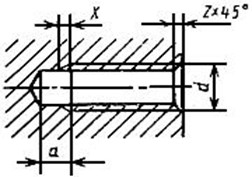
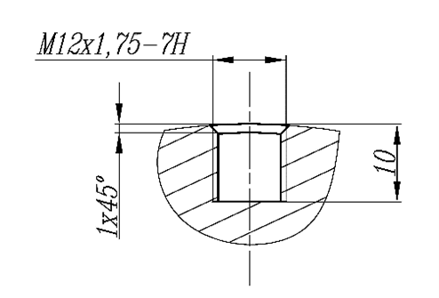
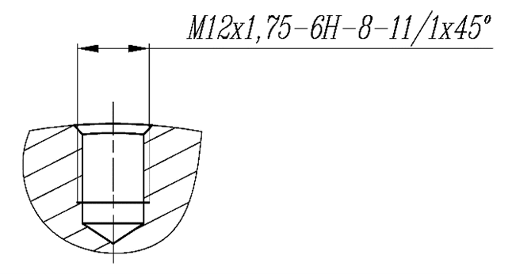

# Меры по снижению рисков забраковки изделий с глухими резьбовыми отверстиями в процессе производства

В должностную папку:
+ РО4
+ НО №11А, 11Б, 12А, 13
+ Мастерам токарной и фрезерной групп
+ Мастеру слесарного участка
+ Наладчикам
+ Операторам станков с ЧПУ
+ Контролёрам ОТК
+ Технологам-программистам

## Общие положения

Наиболее распространённым способом стыковки элементов различных конструкций является резьбовое соединение. Оно широко применяется в строительстве, при монтаже трубопроводов, в машиностроении и многих других отраслях. Популярность этого способа обусловлена следующими преимуществами:

- высокая надёжность и продолжительный срок службы;
- создание разъёмных соединений, простота монтажа и демонтажа при помощи общедоступных инструментов;
- контроль силы затягивания при сборке;
- малый вес и размеры крепежа, по сравнению с соединяемыми конструктивными элементами;
- широкая доступность, большой выбор типоразмеров крепежа.

В своей производственной деятельности сотрудники ООО «ПФ-ФОРУМ» сталкиваются со сквозными и глухими резьбовыми отверстиями. В условиях ООО «ПФ-ФОРУМ» данные виды резьбовых отверстий выполняются на токарных (токарно-фрезерных) или фрезерных станках с ЧПУ и выполняются метчиками, метчиками-раскатниками, резьбонарезными фрезами, а также резьбовыми резцами.

Данное инструктивное письмо прописывает все возможные меры по снижению рисков забраковки изделий с глухими резьбовыми отверстиями.

## Термины и определения

Особенностью для глухого резьбового соединения является сбег и недовод (недорез) резьбы.

- **Сбег резьбы** — участок неполного профиля в зоне перехода резьбы в гладкую часть детали.
- **Недовод (недорез) резьбы** — величина ненарезанной части поверхности детали между концом сбега и опорной поверхностью детали (при переходе с одного диаметра на другой).

Пример приведён на рис. 1.  
*рис. 1*

Величина недовода (недореза) резьбы и сбега резьбы регламентируется ГОСТ 10549-80 «Выход резьбы. Сбеги, недорезы, проточки и фаски».

## Требования к технологам-конструкторам

При создании технологического процесса обработки изделий (далее — ТП) в условиях ООО «ПФ-ФОРУМ» технологу-конструктору необходимо:

- обращать внимание на размеры глубины резьбовой части глухих отверстий;
- учитывать наличие резьбонарезного инструмента и применять таблицу «Величина захода режущей кромки метчиков и раскатников для нарезания резьбы в глухих отверстиях» (см. Приложение №1);
- указывать и при необходимости изменять глубину отверстия с учётом выдерживания глубины резьбовой части отверстия;
- при невозможности увеличения глубины отверстия связываться с заказчиком и согласовывать данные размеры.

## Требования к операторам станков с ЧПУ

При изготовлении изделия по конструкторской документации заказчика (далее — КД) оператору станков с ЧПУ необходимо:

- обращать внимание на размеры глубины резьбовой части глухих отверстий;
- учитывать наличие резьбонарезного инструмента и применять таблицу «Величина захода режущей кромки метчиков и раскатников для нарезания резьбы в глухих отверстиях» (см. Приложение №1);
- выполнять и при необходимости изменять глубину отверстия с учётом выдерживания глубины резьбовой части отверстия;
- при невозможности увеличения глубины отверстия связываться с технологом-конструктором и согласовывать данные размеры.

## Проверка конструкторской документации

При передаче КД в цех для производства изделия без ТП, технологу-конструктору необходимо проверить КД на соответствие недорезов резьбовых глухих отверстий с таблицей «Величина захода режущей кромки метчиков и раскатников для нарезания резьбы в глухих отверстиях» (см. Приложение №1).

## Примеры обозначений на чертежах

- На рисунке 2 приведён пример глухого резьбового отверстия **М12х1,75**.  
  В данном случае технологу-конструктору необходимо связаться с заказчиком или через менеджеров по продажам, сообщить о невозможности выполнения данного отверстия по КД.  
  Требуется уточнить глубину резьбы и величину недореза резьбы, согласовать глубины под имеющийся в наличии инструмент.  
  *рис. 2*

- На рисунке 3 приведён пример глухого резьбового отверстия **М12х1,75**, допуск резьбы **6Н**, глубина резьбы **8 мм**, глубина отверстия под резьбу **11 мм** и размер фаски **1х45**.  
  *рис. 3*

## Заключение

Своевременно внесённые изменения в КД и предпринятые решения по увеличению глубины отверстия под резьбу способствуют сохранению качества резьбовых отверстий и сокращают сроки производства изделий на станках.

## Приложение №1

**Таблица «Величина захода режущей кромки метчиков и раскатников для нарезания резьбы в глухих отверстиях»**

| Резьба      | Метчик | Раскатник |
|-------------|--------|-----------|
| М 2х0,4     | 3,5 мм |           |
| М 2,5х0,45  | 2,5 мм |           |
| М 3х0,5     | 3 мм   | 1,5 мм    |
| М 4х0,7     | 4 мм   | 2 мм      |
| М 5х0,8     | 4,5 мм | 2,5 мм    |
| М 6х1       | 5,5 мм | 3 мм      |
| М 8х1,25    | 4 мм   | 3,5 мм    |
| М 10х1,5    | 4,5 мм | 4 мм      |
| М 12х1,75   | 6 мм   | 5 мм      |
