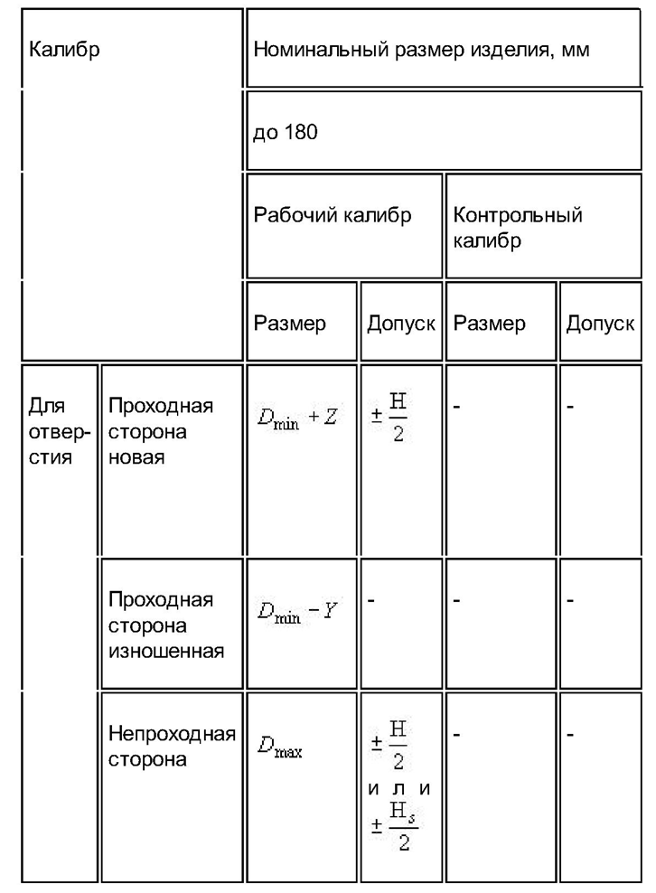
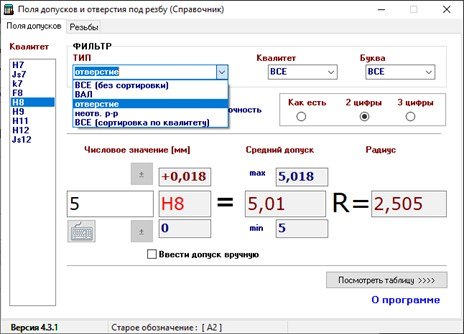
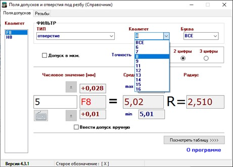
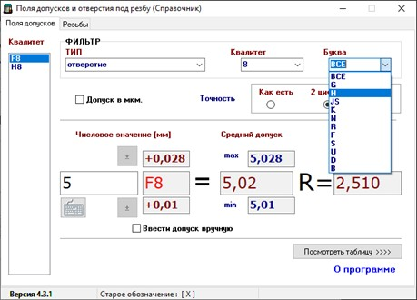
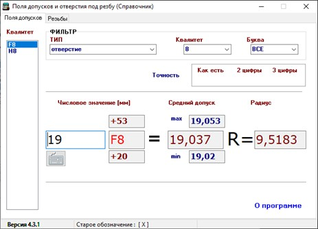
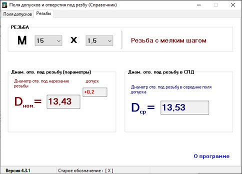

# Порядок действий операторов и наладчиков в случае отсутствия стандартных калибров в процессе производства

> ⚙️ **Данное Инструктивное Письмо** направлено на внедрение в работу порядка действий операторов и наладчиков в случае  
отсутствия стандартных калибров в процессе производства и на полное исключение такого вида брака, как *дефекты прохода или не прохода*  
в контролируемых гладких отверстиях на деталях производства.

## Основные проблемы

> ❌ В процессе работы мы **постоянно сталкиваемся** с таким видом брака, как:
> - отсутствие прохода,
> - либо наоборот — *не проход «идёт»* в контролируемые гладкие отверстия.

Причина возникновения дефекта:
- операторы **не изготавливают нестандартную проверочную гладкую пробку**,
- проводят замеры *штангенциркулем*.

**Последствия дефектов:**
- окончательная *забраковка* деталей,
- доработка на станках или слесарном участке,
- рост себестоимости производства,
- загруженность оборудования,
- снижение прибыли и **срыв сроков отгрузки** заказчику.

> ✅ Все гладкие отверстия необходимо проверять **только стандартным калибром** или калибром, изготовленным самостоятельно.

## 📋 Порядок действий операторов

### 🔹 Подготовка к постановке изделия

Оператору **в обязательном порядке** необходимо:

- просмотреть **чертёж** на изделие;
- собрать проверочные калибры;
- если отсутствует стандартная гладкая пробка — предпринять шаги по решению проблемы.

### 1. На токарном участке

- Если **стандартный калибр отсутствует**:
    - оператор **уведомляет мастера смены**,
    - изготавливает калибр *перед началом наладки партии деталей*,
    - использует программу «**Поля допусков и отверстий по резьбу**», установленную на компьютерах операторов ЧПУ.  
      *(см. Приложение №1, Таблица №1)*

### 2. На фрезерном участке

- Изготовление самодельных калибров должно быть **запланировано заранее** до постановки изделий в производство.
- Если **отсутствует калибр** (стандартный или самодельный):
    - оператор **уведомляет НО12А** для корректировки плана загрузки оборудования,
    - включает в план изготовление калибра на токарном участке.
- ⚠️ Оборудование **не должно простаивать** в ожидании изготовления калибра.

## 🛠 Требования к материалам

Применяемый материал для изготовления калибров необходимо согласовывать с мастером заготовительного участка.

> **Предпочтительные марки стали:**
> - СТ45
> - СТ40Х

🔎 При использовании самодельных калибров их размеры необходимо проверять **мерительным инструментом несколько раз в смену**.

## 📑 Приложение №1

### Таблица №1

## 📑 Приложение №2

1. **Выбрать тип обработки**  
   

2. **Выбрать квалитет**  
   

3. **Выбрать букву**  
   

4. **Поставить допуск** (*в мкм и точность 3 цифры*)  
   

5. **Допуск по резьбе** *(при необходимости)*  
   
