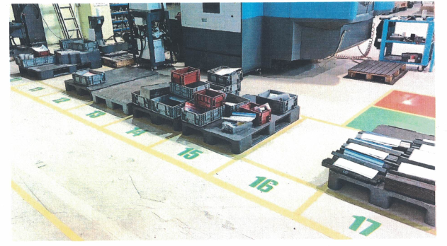
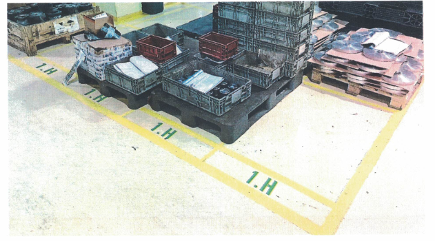
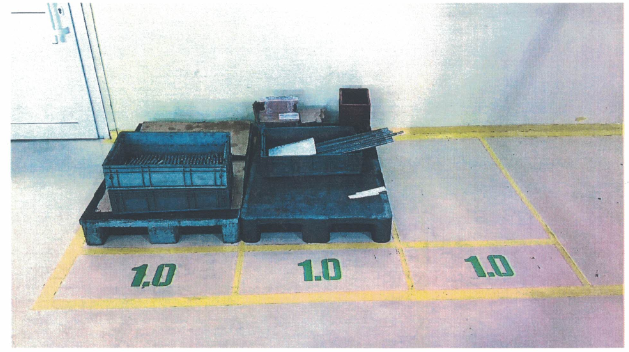
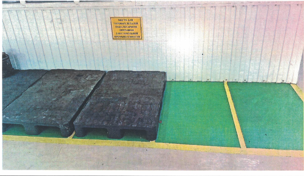
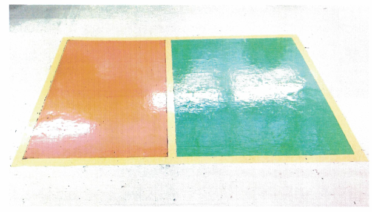
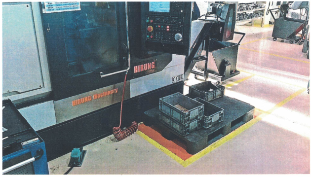
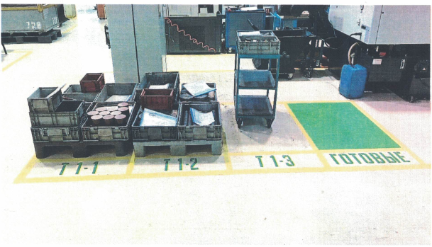
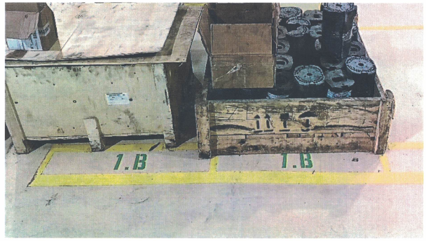
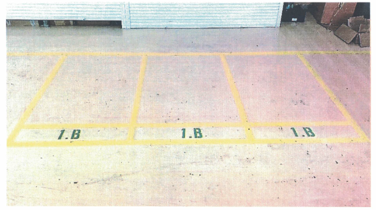
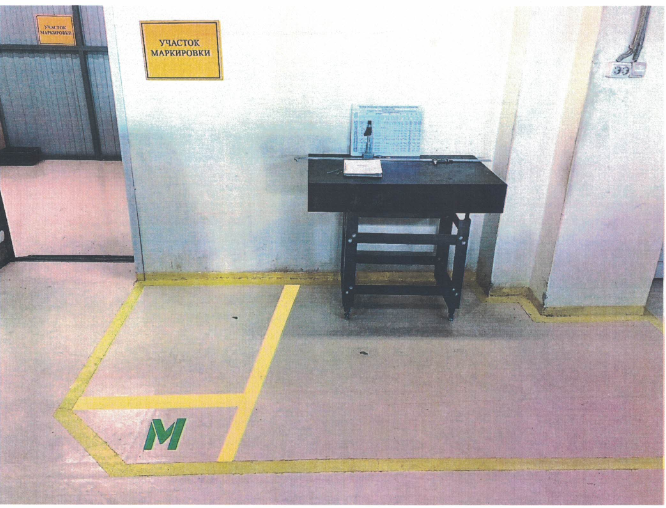

# 📑 Распределение полуфабрикатов и готовой продукции согласно обозначенных ячеек

## ⚙️ Ячейки фрезерного участка

### 🛠 Ячейка ПООПЕРАЦИОННАЯ

| Обозначение ячеек | Назначение ячеек                                                                                                   | Кто пополняет                   | Кто забирает                   |
|-------------------|--------------------------------------------------------------------------------------------------------------------|---------------------------------|--------------------------------|
| **10-17**         | 🛠 Ячейка ПООПЕРАЦИОННАЯ, предназначена для постановки изделий **на фрезерном участке** согласно нумерации станков | Мастер заготовительного участка | Оператор станков ЧПУ, наладчик |

### ⚙️ Ячейка НЕЗАВЕРШЕННОЕ производство

| Обозначение ячеек | Назначение ячеек                                                                                 | Кто пополняет | Кто забирает                                            |
|-------------------|--------------------------------------------------------------------------------------------------|---------------|---------------------------------------------------------|
| **1.Н**           | ⚙️ Ячейка НЕЗАВЕРШЕННОЕ производство. Операторы ЧПУ привозят сюда всё незавершенное производство | Операторы ЧПУ | Мастер заготовительного участка и оператор станка с ЧПУ |

## ✅ Ячейки приёмки и ОТК
###   ✅ Ячейка ОТК
| Обозначение ячеек | Назначение ячеек                                                                                  | Кто пополняет         | Кто забирает  |
|-------------------|---------------------------------------------------------------------------------------------------|-----------------------|---------------|
| **1.О**           | ✅ Ячейка ОТК. Пополняется только готовыми деталями после слесарной обработки или не требующими её | Слесарь, оператор ЧПУ | Контролёр ОТК |

###  🛠 Для формокомплектов и комплектующих
| Обозначение ячеек                                       | Назначение ячеек                                                       | Кто пополняет                             | Кто забирает              |
|---------------------------------------------------------|------------------------------------------------------------------------|-------------------------------------------|---------------------------|
| **Зелёные прямоугольники у слесарно-формового участка** | 🛠 Для формокомплектов и комплектующих, подлежащих слесарной обработке | Операторы фрезерного и токарного участков | Слесарь формового участка |

## 📦 Ячейки упаковки и прожига

| Обозначение ячеек                                                   | Назначение ячеек                       | Кто пополняет                               | Кто забирает                       |
|---------------------------------------------------------------------|----------------------------------------|---------------------------------------------|------------------------------------|
| **Зелёные прямоугольники у стола приёмки формкомплектов 1000х1200** | 📦 Для упаковки готовых формкомплектов | Мастер упаковки, подсобный рабочий, слесарь | Мастер упаковки, подсобный рабочий |
| **Оранжевый прямоугольник у стола приёмки формкомплектов**          | 🔧 Детали для прожига на Супер дрели   | Слесарь                                     | Слесарь                            |

## 🛠 Ячейки у станков

| Обозначение ячеек                                          | Назначение ячеек                                                             | Кто пополняет | Кто забирает |
|------------------------------------------------------------|------------------------------------------------------------------------------|---------------|--------------|
| **Оранжевый прямоугольник у токарных и фрезерных станков** | ⚙️ Участок, на который оператор ставит детали для доработки на данном станке | Оператор      | Оператор     |

## ⚙️ Ячейки токарного участка

| Обозначение ячеек                                                                                                     | Назначение ячеек                                                                                                                                                                           | Кто пополняет                   | Кто забирает                     |
|-----------------------------------------------------------------------------------------------------------------------|--------------------------------------------------------------------------------------------------------------------------------------------------------------------------------------------|---------------------------------|----------------------------------|
| **Т1-1, Т1-2, Т1-3, Т2-1, Т2-2, Т2-3, Т3-1, Т3-2, Т3-3, Т4-1, Т4-2**                                                  | 🛠 Ячейка ПООПЕРАЦИОННАЯ для постановки изделий **на токарном участке** согласно нумерации станков                                                                                         | Мастер заготовительного участка | Оператор станков с ЧПУ, наладчик |
| **Зелёный прямоугольник у станков зоны Т1, Т2, Т3, Т4. Фрезерный участок станок №16 (TOPPER) – подписаны "ГОТОВЫЕ!"** | ✅ Готовые детали после токарной обработки, подлежащие транспортировке на слесарный участок. С зелёной ячейки у токарных станков детали транспортируются слесарями для дальнейшей обработки | Операторы токарного участка     | Слесарь слесарного участка       |

## 📥 Входящие материалы

| Обозначение ячеек | Назначение ячеек                                                                          | Кто пополняет                                        | Кто забирает                                            |
|-------------------|-------------------------------------------------------------------------------------------|------------------------------------------------------|---------------------------------------------------------|
| **1.В**           | 📥 Ячейка ВХОДЯЩЕЕ. Всё давальческое, с термообработки и т.д., поступающее на предприятие | Водитель, кладовщик, мастер заготовительного участка | Начальник производства, мастер заготовительного участка |

## 🔖 Ячейка для маркировки

| Обозначение ячеек | Назначение ячеек                                       | Кто пополняет                   | Кто забирает              |
|-------------------|--------------------------------------------------------|---------------------------------|---------------------------|
| **М**             | 🔖 Ячейка для маркировки изделий на лазерной установке | Слесарь, оператор станков с ЧПУ | Мастер лазерной установки |

