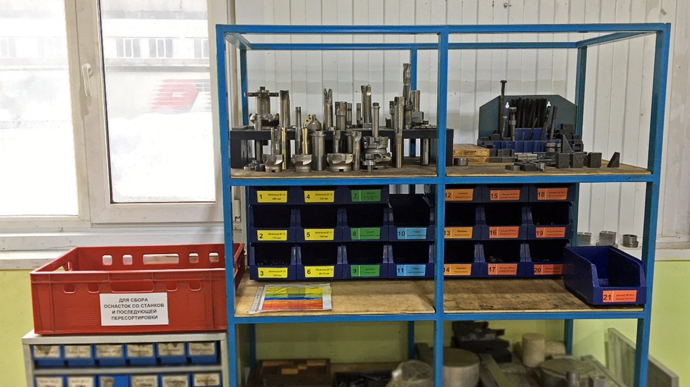

# Использование вспомогательной и крепёжной оснастки (фрезерный участок)

## ⚙️ Общие положения

В течение работы на фрезерном участке постоянно возникает проблема отсутствия необходимой прижимной оснастки.
Причины:

* операторы после использования не разбирают оснастку;
* отсутствует общий перечень;
* оснастка не сортируется;
* не пополняется;
* не контролируется на пригодность.

Это приводит к вынужденным простоям станков из-за длительных наладок.

## 🛠 Порядок использования прижимной оснастки

1. Если в наладочных работах используется прижимная оснастка, оператор ЧПУ должен подойти к стенду, где находятся все
   комплектующие для сборки приспособления (см. Рис. 1).
2. Взять необходимые приспособления и приступить к наладке.
3. После выполнения операции на станке оператор обязан:

    * снять прижимную оснастку;
    * продуть её;
    * положить в красный ящик рядом со стендом с надписью:
      *«Для сбора оснасток со станков и последующей пересортировки»*.
4. Далее:

    * **механик**, а при его отсутствии **наладчик**, выполняет разборку приспособления на комплектующие;
    * проводит ревизию на пригодность;
    * сортирует по предписанным ячейкам.
5. В случае выявления испорченной оснастки механик изымает её из оборота и сразу пополняет в соответствии со списком.
6. Каждый **последний рабочий день месяца (пятница)** механик проводит ревизию по количеству комплектующих и
   предоставляет перечень отклонений руководителю отдела 11Б.
7. Если запасов нет, отдел технического обеспечения подготовки производства делает заказ в отделе снабжения или передаёт
   запрос руководителю отделения 12А для изготовления собственными силами.

**Рис. 1. Стенд с комплектующими прижимной оснастки фрезерного участка**

## 📑 Нормативный список оснастки для фрезерного участка

### 🟡 Шпильки Ø 12

| № | Длина | Кол-во по нормативу |
|---|-------|---------------------|
| 1 | 200   | 26                  |
| 2 | 175   | 26                  |
| 3 | 150   | 26                  |
| 4 | 125   | 26                  |
| 5 | 100   | 26                  |
| 6 | 80-75 | 26                  |

### 🟢 Сухари

| № | Наименование             | Кол-во |
|---|--------------------------|--------|
| 7 | Сухари для 4 оси 11,7 мм | 25     |
| 8 | Сухари (TOPPER) 14 мм    | 25     |
| 9 | Сухари 16 мм             | 70     |

### 🔵 Гайки

| №  | Наименование         | Кол-во |
|----|----------------------|--------|
| 10 | Гайки М12 с буртиком | 40     |
| 11 | Гайки М12 высокие    | 10     |

### 🟠 Прижим

| №  | Наименование     | Кол-во |
|----|------------------|--------|
| 12 | Прижим большой   | 18     |
| 13 | Прижим средний   | 18     |
| 14 | Прижим маленький | 18     |

### 🔴 Домкрат М 24×2

| №  | Наименование         | Кол-во |
|----|----------------------|--------|
| 15 | Домкрат 100 — втулка | 9      |
| 16 | Домкрат 70 — втулка  | 7      |
| 17 | Домкрат 60 — втулка  | 5      |
| 18 | Домкрат 40 — втулка  | 9      |
| 19 | Домкрат 50 — палец   | 16     |

### 🔴 Домкрат М 20×2

| №  | Наименование        | Кол-во |
|----|---------------------|--------|
| 20 | Домкрат 20 — втулка | 16     |
| 21 | Домкрат 30 — палец  | 16     |
