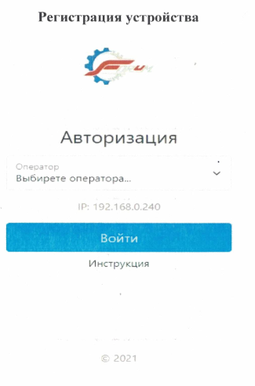

# Инструкция по регистрации в электронном маршрутном листе для мобильного устройства

## Общие положения

* ⚙️ Для регистрации в **Электронной маршрутке** необходимо открыть в телефоне интернет-браузер и перейти по адресу:
  `http://192.168.0.10:8080`

* ✅ Если Вы впервые зашли на данный ресурс, необходимо произвести регистрацию устройства.
  В дальнейшем, если используется устройство, зарегистрированное ранее, вход будет осуществляться автоматически.

* 📑 Выберите из выпадающего списка свою фамилию и нажмите **«Войти»**.
  Эта процедура выполняется один раз и регистрирует за одним оператором только одно мобильное устройство.

* ❌ В случае смены устройства необходимо обратиться к техническим специалистам.

## Регистрация в электронном маршрутном листе

### 1. Шаг «Станок»

* Выберите из выпадающего списка станок, на котором будут производиться операции.

### 2. Шаг «Деталь»

* Выберите из выпадающего списка деталь или введите в поле **«Найти деталь»** часть названия или номер.
* В нижнем выпадающем списке будут предложены позиции, где встречается искомый запрос.

### 3. Шаг «Операция»

* Выберите из выпадающего списка операцию, которая будет производиться с данной деталью.
* В списке отображаются только те операции, которые выполняются с выбранной деталью.

## Завершение регистрации

* 🛠 Нажмите кнопку **«Отправить»** для регистрации в электронном маршрутном листе.
* 🎉 Поздравляем! Вы успешно зарегистрировали операцию в маршрутном листе.
