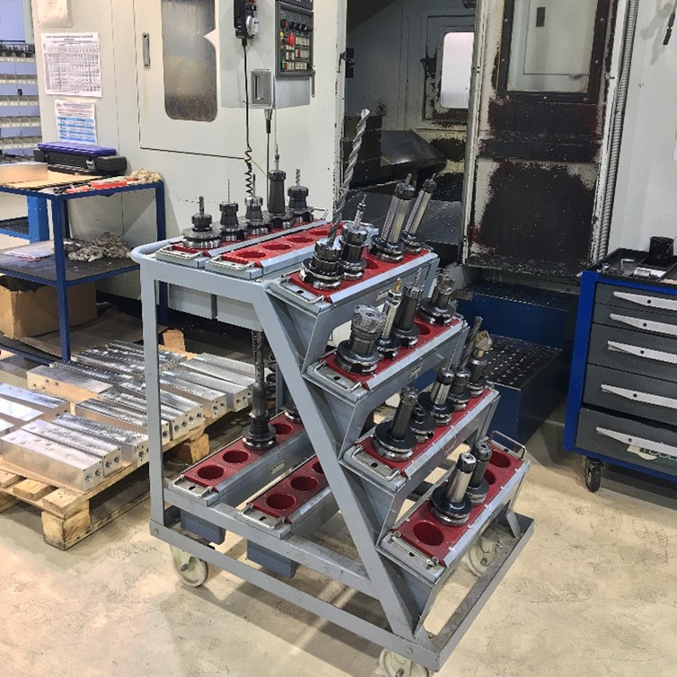
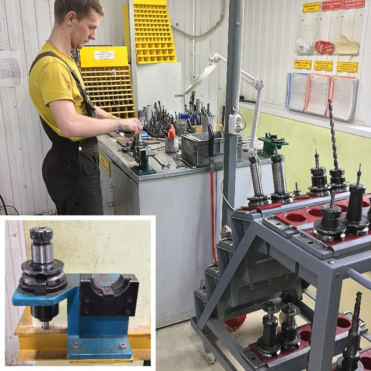
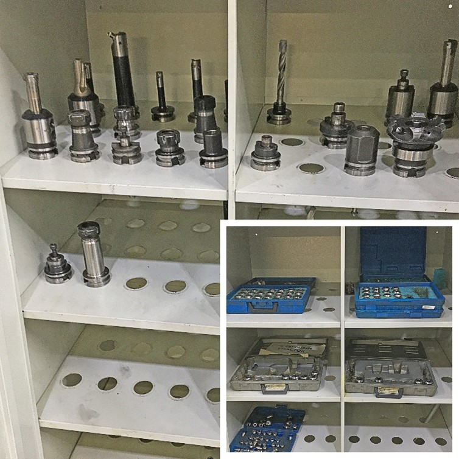
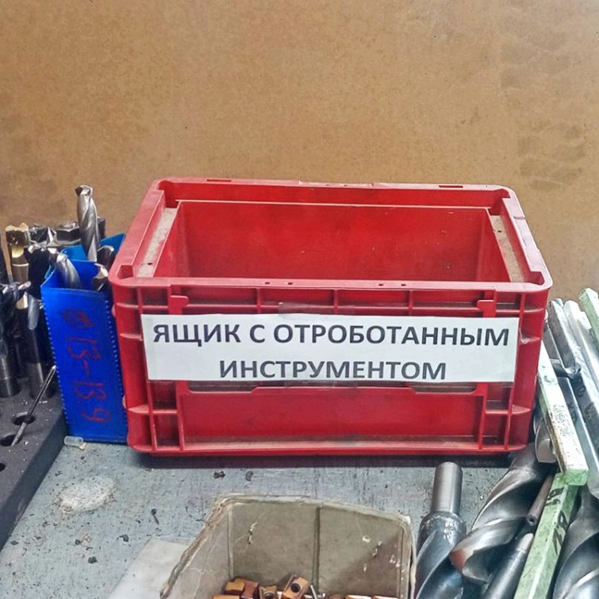
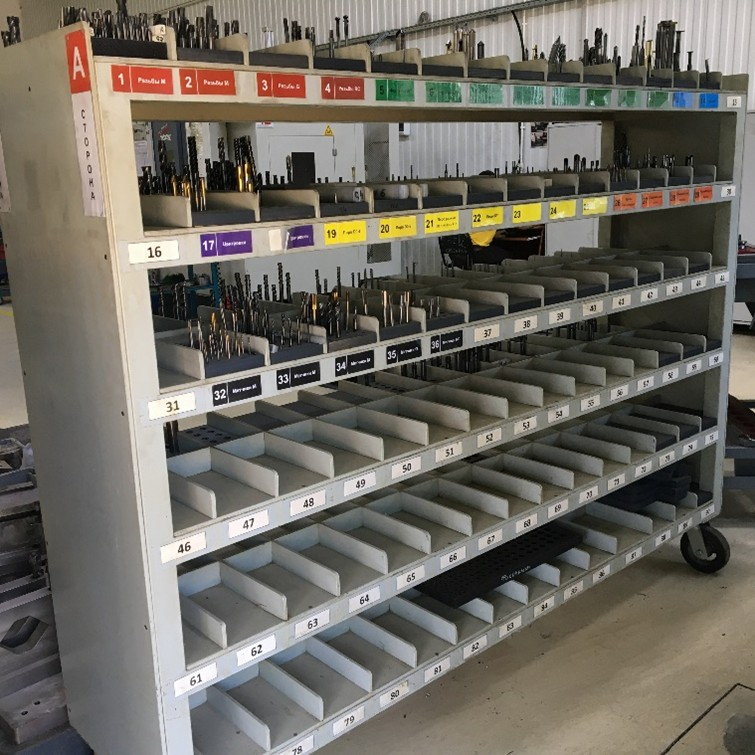
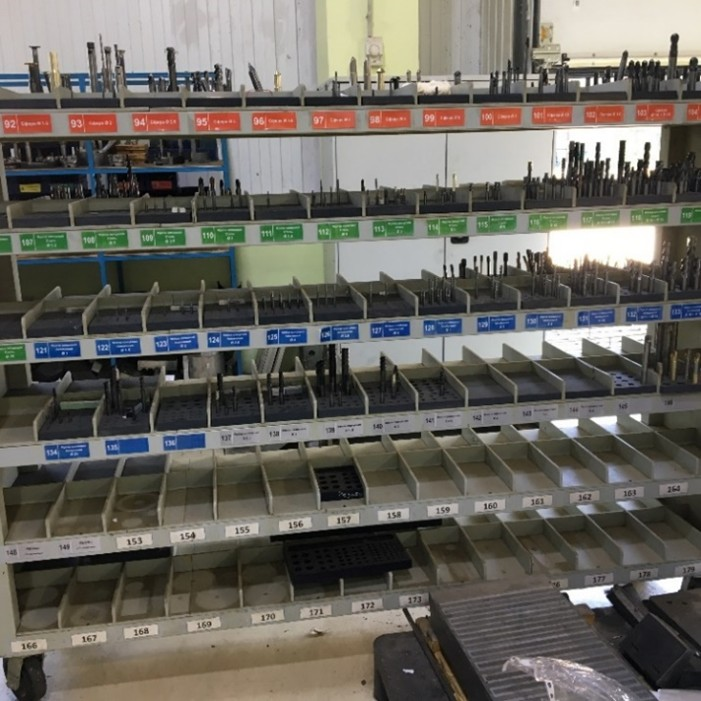
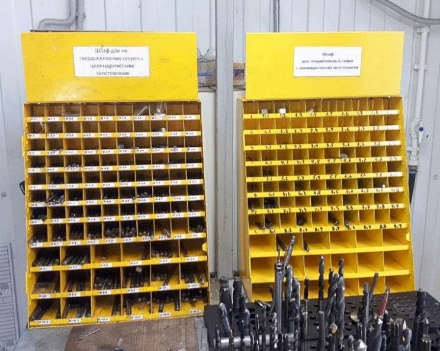

# 📑 Инструктивное письмо по движению инструмента в цехе

## ⚙️ Общие положения

В течение работы операторы станков ЧПУ постоянно сталкиваются с тем, что отсутствует запас необходимого годного
инструмента и его нормативного запаса.

Это приводит к снижению производительности труда, а также увеличению времени производства изделий.

## 🛠 Порядок действий оператора ЧПУ

<table style="border-collapse:collapse; font-size:16px; line-height:1.4; width:100%; text-align:left;">
  <tr>
    <td style="width:50%;">
      
    </td>
    <td style="width:50%;">
После завершения операции-Оператор станков ЧПУ снимает со станка патрон с инструментом и укладывает его в специализированную телегу.
    </td>
  </tr>
  <tr>
    <td style="width:50%;">
     Перевозит его к столу и производит разборку на составляющие.
    </td>
    <td style="width:50%;">
      
    </td>
  </tr>
  <tr>
    <td style="width:50%;">
      
    </td>
    <td style="width:50%;">
      ПРОДУВАЕТ и убирает на отведённое место Цанги и Патроны.
    </td>
  </tr>
  <tr>
    <td style="width:50%;">
      ПРОДУВАЕТ инструмент (фреза, свёрла и тд) и аккуратно укладывает его в красный ящик для использованного инструмента.
    </td>
    <td style="width:50%;">
      
    </td>
  </tr>
  <tr>
    <td style="width:50%;">
      
    </td>
    <td style="width:50%;">
      Заточник совершат утренний обход и проверяет режущий инструмент, снятый со станков, и производит его сортировку на заточку или отправляет на повторное использование укладывая в соответствующие ячейки с нормативным запасом. Табл.1,2.</td>
  </tr>
</table>

## 🛠 Действия заточника

* Заточник совершает утренний обход и проверяет режущий инструмент, снятый со станков, и производит его сортировку:

    * на заточку;
    * либо отправляет на повторное использование, укладывая в соответствующие ячейки с нормативным запасом (Табл. 1, 2).

* После заточки инструмент укладывается в ячейки с нормативным запасом.

* Если инструмента не хватает, заточник производит дополнение инструмента со склада через наладчиков.

* Заточник следит за количеством инструмента в ящиках в соответствии с НЗ.

## 🛠 Действия операторов ЧПУ при наладочных работах

<table style="border-collapse:collapse; font-size:16px; line-height:1.4; width:100%; text-align:left;">
  <tr>    
<td style="width:50%;">
Для наладочных работ операторы ЧПУ берут режущий инструмент из ячеек нормативного запаса (Табл. 1, 2).
    </td>
    <td style="width:50%;">
      
    </td>
  </tr>
  <tr>
    <td style="width:50%;">
      
    </td>
    <td style="width:50%;">
     Для наладочных работ операторы ЧПУ берут сверла из ячеек нормативного запаса. Приложение 11,12
    </td>
  </tr>
</table>

## ✅ Цель документа

Данное инструктивное письмо направлено на организацию культуры производства и подготовку режущего инструмента для
операторов ЧПУ.

## 📑 Таблицы нормативного запаса

### 🔴 СТОРОНА — А

| №        | Резьбофрезы |                |
|----------|-------------|----------------|
| 🔴 1 – 2 | М           | Приложение 1–2 |
| 🔴 3     | G           | Приложение 3   |
| 🔴 4     | RC          | Приложение 4   |

| №          | Фасочники                 |                   | 
|------------|---------------------------|-------------------|
| 🟢 5 – 6   | Фасочник 90°              | 3 (Ø 4; 6; 8; 10) | 
| 🟢 7 – 8   | Фасочник 90° с пластинами | 1                 | 
| 🟢 9       | Фасочник 60°              | 2 (Ø 6; 8; 10)    | 
| 🟢 10      | Фасочник 60° с пластинами | 1                 | 
| 🟢 11 – 12 | Фасочники разные          | разные            | 

| №          | Оправки |        |  
|------------|---------|--------|
| 🔵 13 – 14 | Оправки | разные | 

| №          | Центровки |                          |  
|------------|-----------|--------------------------|
| 🟣 17 – 18 | Центровки | 4 (Ø 4; 5; 6; 8; 10; 16) | 

| №       | Перья                      |             |                |
|---------|----------------------------|-------------|----------------|
| 19      | Перья D 0.4                | 10 (5 длин) | —              |
| 20      | Перья D 0.6                | 10 (5 длин) | —              |
| 21      | Перья R0.5, R1, R1.2, R1.5 | 2           | —              |
| 22      | Перья 60°                  | 4 (2 длин)  | —              |
| 26      | Фреза обратный радиус      | —           | Приложение 5   |
| 27 – 29 | Фрезы специальные          | 30          | —              |
| 32 – 34 | Метчики М                  | —           | Приложение 6–8 |
| 35      | Метчик G                   | —           | Приложение 9   |
| 36      | Метчик RC                  | —           | Приложение 10  |

  <h2 style="text-align:center; letter-spacing:0.5px; margin:8px 0 12px;">
    СТОРОНА
    A
  </h2>

  <table style="width:100%; border-collapse:collapse; table-layout:fixed; font-size:14px;">
    <colgroup>
      <col >
      <col >
      <col >
    </colgroup>

<!-- Резьбофрезы -->
<tr>
<td colspan="3" style="background:#b40000; color:#fff; text-align:center; font-weight:700; padding:10px 8px; border:1px solid #7a0000;">
        Резьбофрезы
      </td>
    </tr>
    <tr>
      <td style="background:#a00000; color:#fff; text-align:center; border:1px solid #7a0000; ">1 – 2</td>
      <td style="background:#a00000; color:#fff; border:1px solid #7a0000; ">M</td>
      <td style="background:#a00000; color:#fff; text-align:right; border:1px solid #7a0000; ">Приложение 1–2</td>
    </tr>
    <tr>
      <td style="background:#a00000; color:#fff; text-align:center; border:1px solid #7a0000; ">3</td>
      <td style="background:#a00000; color:#fff; border:1px solid #7a0000; ">G</td>
      <td style="background:#a00000; color:#fff; text-align:right; border:1px solid #7a0000; ">Приложение 3</td>
    </tr>
    <tr>
      <td style="background:#a00000; color:#fff; text-align:center; border:1px solid #7a0000; ">4</td>
      <td style="background:#a00000; color:#fff; border:1px solid #7a0000; ">RC</td>
      <td style="background:#a00000; color:#fff; text-align:right; border:1px solid #7a0000; ">Приложение 4</td>
    </tr>

<!-- Фасочники -->
<tr>
      <td colspan="3" style="background:#009245; color:#fff; text-align:center; font-weight:700; padding:10px 8px; border:1px solid #006c32;">
        Фасочники
      </td>
    </tr>
    <tr>
      <td style="background:#00a651; color:#fff; text-align:center; border:1px solid #006c32; ">5 – 6</td>
      <td style="background:#00a651; color:#fff; border:1px solid #006c32; ">Фасочник 90°</td>
      <td style="background:#00a651; color:#fff; text-align:right; border:1px solid #006c32; ">3 (Ø 4; 6; 8; 10)</td>
    </tr>
    <tr>
      <td style="background:#00a651; color:#fff; text-align:center; border:1px solid #006c32; ">7 – 8</td>
      <td style="background:#00a651; color:#fff; border:1px solid #006c32; ">Фасочник 90° с пластинами</td>
      <td style="background:#00a651; color:#fff; text-align:right; border:1px solid #006c32; ">1</td>
    </tr>
    <tr>
      <td style="background:#00a651; color:#fff; text-align:center; border:1px solid #006c32; ">9</td>
      <td style="background:#00a651; color:#fff; border:1px solid #006c32; ">Фасочник 60°</td>
      <td style="background:#00a651; color:#fff; text-align:right; border:1px solid #006c32; ">2 (Ø 6; 8; 10)</td>
    </tr>
    <tr>
      <td style="background:#00a651; color:#fff; text-align:center; border:1px solid #006c32; ">10</td>
      <td style="background:#00a651; color:#fff; border:1px solid #006c32; ">Фасочник 60° с пластинами</td>
      <td style="background:#00a651; color:#fff; text-align:right; border:1px solid #006c32; ">1</td>
    </tr>
    <tr>
      <td style="background:#00a651; color:#fff; text-align:center; border:1px solid #0d8b73; ">11 – 12</td>
      <td style="background:#00a651; color:#fff; border:1px solid #0d8b73; ">Фасочники разные</td>
      <td style="background:#00a651; color:#fff; text-align:right; border:1px solid #0d8b73; ">разные</td>
    </tr>
    <tr>
      <td style="background:#1e9edb; color:#fff; text-align:center; border:1px solid #1473a4; ">13 – 14</td>
      <td style="background:#1e9edb; color:#fff; border:1px solid #1473a4; ">Оправки</td>
      <td style="background:#1e9edb; color:#fff; text-align:right; border:1px solid #1473a4; ">разные</td>
    </tr>
    <tr>
      <td style="background:#7b52ab; color:#fff; text-align:center; border:1px solid #573a7b; ">17 – 18</td>
      <td style="background:#7b52ab; color:#fff; border:1px solid #573a7b; ">Центровки</td>
      <td style="background:#7b52ab; color:#fff; text-align:right; border:1px solid #573a7b; ">4 (Ø 4; 5; 6; 8; 10; 16)</td>
    </tr>

<!-- ПерьЯ -->
<tr>
      <td colspan="3" style="background:#ffd400; color:#111; text-align:center; font-weight:700; padding:10px 8px; border:1px solid #c9a300;">
        Перья
      </td>
    </tr>
    <tr>
      <td style="background:#ffe457; color:#111; text-align:center; border:1px solid #c9a300; ">19</td>
      <td style="background:#ffe457; color:#111; border:1px solid #c9a300; ">D 0.4</td>
      <td style="background:#ffe457; color:#111; text-align:right; border:1px solid #c9a300; ">10 (5 длин)</td>
    </tr>
    <tr>
      <td style="background:#ffe457; color:#111; text-align:center; border:1px solid #c9a300; ">20</td>
      <td style="background:#ffe457; color:#111; border:1px solid #c9a300; ">D 0.6</td>
      <td style="background:#ffe457; color:#111; text-align:right; border:1px solid #c9a300; ">10 (5 длин)</td>
    </tr>
    <tr>
      <td style="background:#ffe457; color:#111; text-align:center; border:1px solid #c9a300; ">21</td>
      <td style="background:#ffe457; color:#111; border:1px solid #c9a300; ">R0.5, R1, R1.2, R1.5</td>
      <td style="background:#ffe457; color:#111; text-align:right; border:1px solid #c9a300; ">2</td>
    </tr>
    <tr>
      <td style="background:#ffe457; color:#111; text-align:center; border:1px solid #c9a300; ">22</td>
      <td style="background:#ffe457; color:#111; border:1px solid #c9a300; ">60°</td>
      <td style="background:#ffe457; color:#111; text-align:right; border:1px solid #c9a300; ">4 (2 длины)</td>
    </tr>

<!-- Фрезы -->
<tr>
      <td colspan="3" style="background:#d97a2b; color:#111; text-align:center; font-weight:700; padding:10px 8px; border:1px solid #a85e20;">
        Фрезы
      </td>
    </tr>
    <tr>
      <td style="background:#e89a56; color:#111; text-align:center; border:1px solid #a85e20; ">26</td>
      <td style="background:#e89a56; color:#111; border:1px solid #a85e20; ">Обратный радиус</td>
      <td style="background:#e89a56; color:#111; text-align:right; border:1px solid #a85e20; ">Приложение 5</td>
    </tr>
    <tr>
      <td style="background:#e89a56; color:#111; text-align:center; border:1px solid #a85e20; ">27 – 29</td>
      <td style="background:#e89a56; color:#111; border:1px solid #a85e20; ">Специальные</td>
      <td style="background:#e89a56; color:#111; text-align:right; border:1px solid #a85e20; ">30</td>
    </tr>

<!-- Метчики -->
<tr>
      <td colspan="3" style="background:#3c3c3c; color:#fff; text-align:center; font-weight:700; padding:10px 8px; border:1px solid #2a2a2a;">
        Метчики
      </td>
    </tr>
    <tr>
      <td style="background:#4b4b4b; color:#fff; text-align:center; border:1px solid #2a2a2a; ">32 – 34</td>
      <td style="background:#4b4b4b; color:#fff; border:1px solid #2a2a2a; ">M</td>
      <td style="background:#4b4b4b; color:#fff; text-align:right; border:1px solid #2a2a2a; ">Приложение 6–8</td>
    </tr>
    <tr>
      <td style="background:#4b4b4b; color:#fff; text-align:center; border:1px solid #2a2a2a; ">35</td>
      <td style="background:#4b4b4b; color:#fff; border:1px solid #2a2a2a; ">G</td>
      <td style="background:#4b4b4b; color:#fff; text-align:right; border:1px solid #2a2a2a; ">Приложение 9</td>
    </tr>
    <tr>
      <td style="background:#4b4b4b; color:#fff; text-align:center; border:1px solid #2a2a2a; ">36</td>
      <td style="background:#4b4b4b; color:#fff; border:1px solid #2a2a2a; ">RC</td>
      <td style="background:#4b4b4b; color:#fff; text-align:right; border:1px solid #2a2a2a; ">Приложение 10</td>
    </tr>

  </table>

---

### 🔧 СТОРОНА — Фрезы сферы, концевые и радиусные

#### Фрезы сферы

| №   | Ø       | Кол-во |
|-----|---------|--------|
| 91  | 1       | 2      |
| 92  | 1,5     | 2      |
| 93  | 2       | 2      |
| 94  | 2,5     | 2      |
| 95  | 3       | 2      |
| 96  | 3,5     | 2      |
| 97  | 4       | 2      |
| 98  | 5       | 2      |
| 99  | 6       | 3      |
| 100 | 8       | 2      |
| 101 | 10      | 2      |
| 102 | 12      | 2      |
| 103 | 14 + 16 | 3      |
| 104 | 18 + 20 | 2      |

#### Фрезы концевые по стали

| №   | Ø       | Кол-во     |
|-----|---------|------------|
| 105 | 20      | 4 + 2 длин |
| 106 | 1       | 3          |
| 107 | 1,5     | 3          |
| 108 | 2       | 3          |
| 109 | 2,5     | 3          |
| 110 | 3       | 3          |
| 111 | 3,5     | 3          |
| 112 | 4       | 3          |
| 113 | 5       | 3          |
| 114 | 6       | 4          |
| 115 | 8       | 4          |
| 116 | 10      | 4          |
| 117 | 12 + 14 | 4          |
| 118 | 16 + 18 | 4 + 2 длин |
| 119 | 20      | 4 + 2 длин |

#### Фрезы концевые по алюминию

| №   | Ø       | Кол-во     |
|-----|---------|------------|
| 121 | 1       | 3          |
| 122 | 1,5     | 3          |
| 123 | 2       | 3          |
| 124 | 2,5     | 3          |
| 125 | 3       | 3          |
| 126 | 3,5     | 3          |
| 127 | 4       | 3          |
| 128 | 5       | 3          |
| 129 | 6       | 3          |
| 130 | 8       | 3          |
| 131 | 10      | 3          |
| 132 | 12 + 14 | 3          |
| 133 | 16 + 18 | 3 + 2 длин |
| 134 | 20      | 3 + 2 длин |

#### Радиусные фрезы

| №         | Радиус             | Кол-во |
|-----------|--------------------|--------|
| 137       | R 0.5              | 1      |
| 138       | R 1                | 1      |
| 139       | R 1.5              | 1      |
| 140       | R 2                | 1      |
| 141       | R 2.5              | 1      |
| 142       | R 3                | 1      |
| 143       | R 4                | 1      |
| 144       | R 5                | 1      |
| 148 – 149 | Фрезы с пластинами | 5      |
