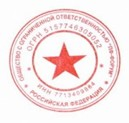
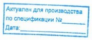

# 📑 Регламент

«По порядку разработки и дальнейшего использования технологического процесса обработки изделий на производстве компании
ООО «ПФ-ФОРУМ»

## ⚙️ Оглавление

1. ВВЕДЕНИЕ
   1.1. НАЗНАЧЕНИЕ РЕГЛАМЕНТА
   1.2. ОБЛАСТЬ ПРИМЕНЕНИЯ

2. ОПИСАНИЕ ПРОЦЕССА
   2.1. ЦЕЛЬ РЕГЛАМЕНТА
   2.2. ЗАМЫСЕЛ
   2.3. ОПРЕДЕЛЕНИЕ ТЕХНОЛОГИЧЕСКОГО ПРОЦЕССА (ТП)
   2.4. РАЗРАБОТКА ТП
   2.5. РАЗРАБОТКА ПИ СОГЛАСНО ТП
   2.6. КОНТРОЛЬ ТЕХНОЛОГИЧЕСКОГО ПРОЦЕССА
   2.7. ИСПОЛЬЗОВАНИЕ И ОТРАБОТКА ТП В ПРОИЗВОДСТВЕ
   2.8. ХРАНЕНИЕ ТП В АРХИВЕ
   2.9. ПРАВИЛА ЗАМЕНЫ И УТИЛИЗАЦИЯ ТП

3. ОТВЕТСТВЕННОСТЬ ЗА СОБЛЮДЕНИЕ РЕГЛАМЕНТА

4. КОНТРОЛЬ ИСПОЛНЕНИЯ РЕГЛАМЕНТА

## 1. Введение

### 1.1. Назначение регламента

Настоящий регламент определяет порядок разработки и дальнейшего использования технологического процесса обработки
изделий на производстве компании ООО «ПФ-ФОРУМ».

### 1.2. Область применения

Регламент распространяется на:

* директора по производству (ЗТВ),
* руководителя отделений №4, №5,
* начальников отделов №11А, №11Б, №12А, №12Б, №13,
* технологов-программистов,
* мастеров смен токарной и фрезерной групп,
* мастера слесарного участка,
* наладчиков, операторов станков с ЧПУ,
* контролёров ОТК.

Каждый сотрудник, ответственный за элементы процесса, обязан выполнять требования данного регламента.

## 2. Описание процесса

### 2.1. Цель регламента

Разработка, использование и хранение технологического процесса в производстве компании ООО «ПФ-ФОРУМ».

### 2.2. Замысел

Строгое выполнение установленных регламентом действий каждым сотрудником, участвующим в процессе разработки
технологического процесса и дальнейшего его использования.

### 2.3. Определение технологического процесса (ТП)

Технологический процесс (ТП) — система взаимосвязанных действий, выполняющихся с момента возникновения исходных данных
до получения нужного результата (ЦКП).

### 2.4. Разработка ТП

ТП разрабатывается технологом с учётом:

* состава станочного парка предприятия,
* особенностей и параметров оборудования,
* стратегии обработки,
* параметров и марки материала заготовки.

Допускается корректировка стратегии обработки и параметров заготовки при согласовании с отделами:

* планирования и закупок,
* производства.

Разработка ТП должна учитывать требования ГОСТов и нормативной документации. Для сложных изделий технологию необходимо
согласовывать с КТО, технологами-программистами и производством.

### 2.5. Разработка приспособлений (ПИ) согласно ТП

* При необходимости разрабатываются приспособления (ПИ) для станков с ЧПУ.
* На каждое приспособление выпускается чертёж, закрепляемый в ТП.
* Использование ПИ осуществляется согласно внутренней документации.

### 2.6. Контроль технологического процесса

* ТП печатается (А4/А3), сшивается в папку-скоросшиватель.
* Технолог осуществляет самоконтроль и несёт ответственность за ошибки.
* Проверка проходит: технолог-программист → начальник КТО.
* Все участники подписывают титульный лист.
* На титульных и операционных листах проставляются печати.

#### Таблица №1. Виды печати, используемых для ТП

<table>
  <thead>
    <tr>
      <th>№</th>
      <th>Применение печати</th>
      <th>Изображение</th>
      <th>Значение</th>
    </tr>
  </thead>
  <tbody>
    <tr>
      <td>1</td>
      <td>Для ТП оборонно-промышленного комплекса</td>
      <td></td>
      <td>Повышенный контроль и требования</td>
    </tr>
    <tr>
      <td>2</td>
      <td>Для новых ТП</td>
      <td></td>
      <td>Оператору и ОТК сравнить с КД</td>
    </tr>
    <tr>
      <td>3</td>
      <td>Для отработанных и скорректированных ТП</td>
      <td></td>
      <td>Подтверждает отработанность и наличие УП</td>
    </tr>
    <tr>
      <td>4</td>
      <td>Для ТП из давальческого материала</td>
      <td></td>
      <td>Контроль количества изделий и брака</td>
    </tr>
    <tr>
      <td>5</td>
      <td>Для ТП с изменениями по инициативе заказчика</td>
      <td></td>
      <td>Внимание на изменения в КД и ТП</td>
    </tr>
    <tr>
      <td>6</td>
      <td>Для дубликатов ТП</td>
      <td></td>
      <td>Пометка «КОПИЯ»</td>
    </tr>
    <tr>
      <td>7</td>
      <td>Для ТП на изделия ООО НПО "ЗЭРС"</td>
      <td></td>
      <td>Отдельная печать по заказчику</td>
    </tr>
  </tbody>
</table>

Особые правила:

* Новые ТП помечаются «НОВОЕ! СРАВНИТЬ С КД».
* После отработки бумажный вариант передаётся в архив.
* При изменениях ТП обновляется и заносится в архив.
* Для изделий простого конструктива допускается запуск по чертежу с необходимыми печатями и пояснениями.

### 2.7. Использование и отработка ТП в производстве

* Используются только проверенные и утверждённые ТП с подписями.
* В ходе отработки вносятся корректировки с обязательной подписью мастера смены.
* Глобальные изменения фиксируются разработчиком в обновлённом ТП.
* Операторы сохраняют УП на сервере в специальную папку. Контроль — мастер смены.

### 2.8. Хранение ТП в архиве

* ТП хранится в печатном и электронном виде.
* Электронный вид размещается на сервере в разделе «Технология».
* Печатный вариант хранится в архиве отдела производства.
* Допускается наличие «КОПИЙ», которые уничтожаются архивом после изъятия.

### 2.9. Правила замены и утилизации ТП

* Повреждённые ТП уничтожаются архивом.
* На замену печатается новый ТП из электронного архива.
* Новый экземпляр подписывается, снабжается печатями и вводится в производство.

## 3. Ответственность за соблюдение регламента

Соблюдение последовательности действий обязательно для всех участников процесса разработки и использования ТП.

## 4. Контроль исполнения

За контроль исполнения отвечают:

* директор по производству,
* руководитель отделения №4,
* начальник КТО,
* начальник отдела производства.
