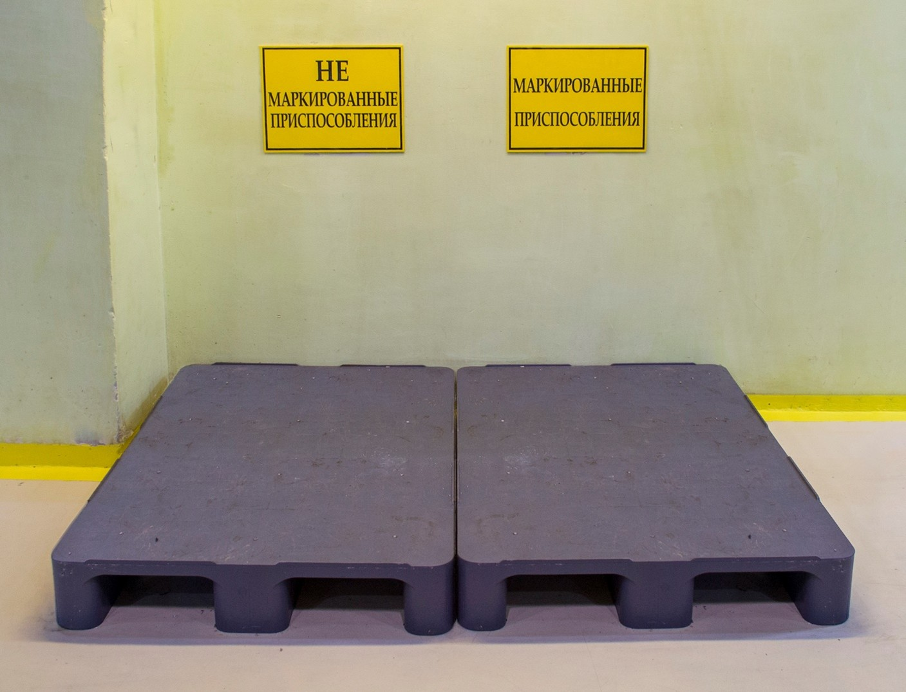
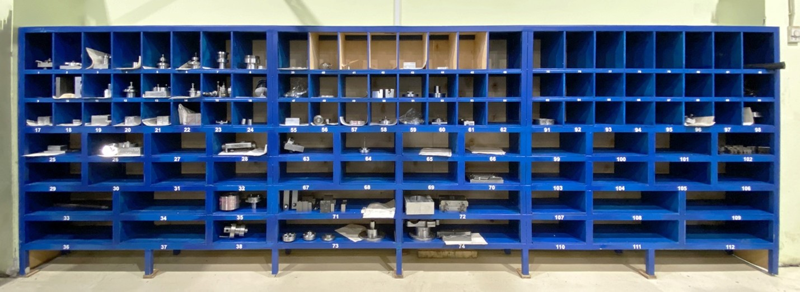
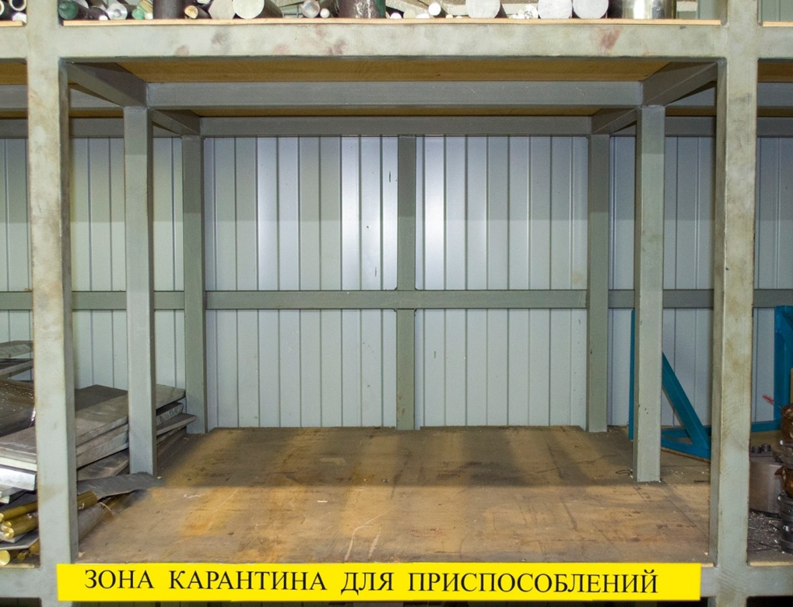

# 📑 Регламент

**По контролю, учёту и правилам использования приспособлений в производстве компании ООО «ПФ-ФОРУМ»**

---

## ⚙️ Оглавление

1. Введение
   1.1 Назначение регламента
   1.2 Область применения

2. Описание процесса
   2.1 Цель регламента
   2.2 Замысел
   2.3 Определение технологической оснастки (ПИ)
   2.4 Разработка ПИ
   2.5 Изготовление ПИ
   2.6 Маркировка ПИ
   2.7 Правило использования и хранение ПИ
   2.8 Ремонт, проверка и утилизация ПИ

3. Ответственность за соблюдение регламента

4. Контроль исполнения регламента

---

## 1. Введение

### 1.1 Назначение регламента

Настоящий регламент определяет порядок контроля, учёта и правила использования приспособлений в условиях производства
компании ООО «ПФ-ФОРУМ».

### 1.2 Область применения

Регламент распространяется на:

* директора по производству (ЗТВ),
* руководителей отделений №1, №4,
* начальников отделов №11А, №11Б, №12А,
* мастеров смен токарной и фрезерной групп,
* мастера слесарного участка,
* мастера заготовительного участка,
* операторов станков с ЧПУ,
* наладчиков, механиков,
* технологов-программистов,
* маркировщика, заточника.

Каждый сотрудник, ответственный за элементы процесса, обязан выполнять требования данного регламента.

---

## 2. Описание процесса

### 2.1 Цель регламента

Разработка, использование и хранение приспособлений в производстве ООО «ПФ-ФОРУМ».

### 2.2 Замысел

Выполнение установленных регламентом действий каждым сотрудником, участвующим в процессе изготовления и дальнейшего
движения ПИ в производстве ООО «ПФ-ФОРУМ».

### 2.3 Определение технологической оснастки (ПИ)

Технологическая оснастка (Приспособление – ПИ) – это специальная технологическая оснастка, которая может относиться как
к одному, так и к нескольким видам изделий.

* ПИ может состоять из одной или нескольких комплектующих.
* С помощью ПИ можно правильно сориентировать (базировать) изделие.
* Обеспечивается возможность обрабатывать несколько изделий одной операции.
* Ускоряется процесс изготовления и увеличивается время оператора на замену изделий в станке.
* Может использоваться для финишной обработки изделий на слесарном участке.

### 2.4 Разработка ПИ

При разработке технологического процесса обработки изделия технолог-программист:

* разрабатывает специальное ПИ на основе КД и 3D модели изделия,
* делает чертёж и программу для обработки ПИ (если необходимо),
* присваивает порядковый номер для хранения в ячейке,
* заносит номер ПИ в СОФТ и в ТП.

### 2.5 Изготовление ПИ

* НО12А при планировании изготовления изделия руководствуется данными ТП.
* Если в ТП предусмотрено изготовление ПИ, НО12А включает его в план производства.
* Чертёж ПИ передаётся мастеру заготовительного участка для подбора материала и изготовления.
* После подготовки материала заготовка перемещается на станок, где будет изготовлено ПИ.

### 2.6 Маркировка ПИ

* После изготовления и использования ПИ оператор, мастер смены или наладчик относит ПИ и чертёж в специально отведённое
  место на участке маркировки.

* Маркировщик наносит:

    * порядковый номер ячейки ПИ,
    * номер операции,
    * наименование изделия.
* После маркировки информация передаётся наладчику, который перемещает ПИ в ячейку для хранения.
* Если инициатором изготовления выступает мастер смены или оператор, то:
    * они передают ПИ и чертёж на участок маркировки,
    * наладчик с технологом присваивают номер ПИ в СОФТе,
    * технолог вносит изменения в ТП,
    * ПИ маркируется и помещается в ячейку стеллажа.

### 2.7 Правило использования и хранения ПИ

* При запуске изделия оператор, мастер или наладчик сверяет номер ПИ с указанным в ТП.
* После завершения операции ПИ возвращается в ячейку в первоначальном виде.

### 2.8 Ремонт, проверка и утилизация ПИ

* ПИ может изнашиваться и ломаться, что влияет на качество продукции.
* При выявлении отклонений необходимо сообщить мастеру смены, наладчику и НО12А.
* Решение о ремонте, доработке или утилизации принимается механиками или РО4.
* Наладчик еженедельно (по понедельникам) проводит ревизию ПИ, планируемых к использованию.
* ОТО и ПП проводят ревизию ПИ 1 раз в год.
* Если ПИ используется реже 1 раза в год — оно отправляется в «карантин» (участок аутсорс).
* При отсутствии заказов в течение года ПИ утилизируется.
* Технолог освобождает номер ячейки в СОФТе.

---

## 3. Ответственность за соблюдение регламента

Каждый участник процесса обязан соблюдать последовательность действий.
От состояния ПИ и правильного хранения зависит:

* скорость поиска,
* процесс обработки изделия,
* срок выполнения заказа,
* соответствие изделия требованиям КД и ТП.

---

## 4. Контроль исполнения

За контроль исполнения регламента отвечают:

* директор по производству,
* РО4,
* РО1.

---

## 📝 Опросный лист

к «Регламенту по контролю, учёту и правилам использования приспособлений в производстве компании ООО «ПФ-ФОРУМ»

**Условие:** проверка считается пройденной, если результат ≥ 90%.
Если процент ниже — требуется повторное изучение инструкции.
Время прохождения не ограничено. Можно пользоваться инструкцией.

**ФИО** \_\_\_\_\_\_\_\_\_\_\_\_\_\_\_\_\_\_\_\_\_\_\_\_\_\_\_\_\_\_\_\_\_\_\_\_\_\_\_\_\_\_
**Должность** \_\_\_\_\_\_\_\_\_\_\_\_\_\_\_\_\_\_\_\_\_\_\_\_\_\_\_\_\_\_\_\_\_\_\_\_\_

1. Что такое «технологическая оснастка» и из чего она состоит?

---

2. Чем изначально руководствуется технолог-программист при разработке ПИ?

---

3. Определите порядок разработки ПИ технологом-программистом.

---

4. Что необходимо учитывать НО12А при занесении изготовления ПИ в план производства?

---

5. Где находится подготовленная заготовка для изготовления ПИ?

---

6. Куда необходимо отнести ПИ и чертёж после изготовления приспособления и его использования на станке?

---

7. В случаях, когда инициатором изготовления ПИ выступает мастер смены или оператор станков с ЧПУ, куда ему необходимо
   отнести ПИ и чертёж?

---

8. При запуске изделия в работу какую информацию в ТП необходимо учитывать?

---

9. Что необходимо сделать оператору, мастеру смены или наладчику после завершения операции изготовления изделия с ПИ?

---

10. Что необходимо сделать при выявлении отклонений в работе с ПИ?

---
