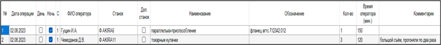
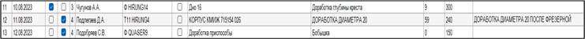
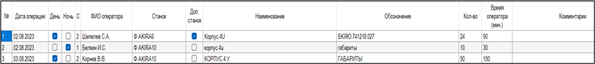
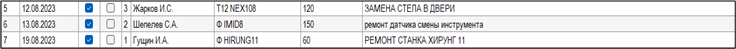

# По заполнению Электронного Маршрутного Листа оператором станков с ЧПУ

Данное Инструктивное Письмо направлено на правильное и корректное занесение данных в Электронный Маршрутный Лист (ЭМЛ).

В процессе работы производство сталкивается с некоторыми сложностями, которые связаны с правилами заполнения операторами станков с ЧПУ Электронного Маршрутного Листа. Данные трудности вызваны непониманием — какие виды работ и куда нужно записывать.

В ЭМЛ есть такие графы: **ОСНАСТКА, ГАБАРИТЫ, ДОРАБОТКА, ПРОСТОИ.**

Разберём каждую по отдельности:

---

## ⚙️ ОСНАСТКА

В графе **ОСНАСТКА** заполняется только изготовление приспособлений:

* резьбовых,
* разрезных втулок,
* токарных кулачков,
* изготовление калибров,
* деталей на станки для внутреннего производства.

---

## 🛠 ДОРАБОТКА

В графу **ДОРАБОТКА** заносятся только те детали, которые дорабатывались на станке в результате расхождения несоответствий с КД или ТП.

---

## 📏 ГАБАРИТЫ

В графу **ГАБАРИТЫ** заносятся только те детали, которые из-за кривизны заготовок невозможно закрепить в тисках или приспособлении.

❗️НО! Только с тем условием, если эта операция **НЕ** предусмотрена в ТП.

---

## ⏱ ПРОСТОИ

Графа **ПРОСТОИ** обязательна к заполнению.
В ней необходимо указывать причину и время простоя оборудования.

---

## ❌ Важно

НЕ писать в вышеописанные графы:

* замену,
* корректировку,
* поиск инструмента,
* поиск калибров.

---

## 📌 Ситуация

При обработке деталей **КОРПУС БК-Е22 (сталь 12Х18Н10Т)** часто изнашивался инструмент (частая замена пластин, фрез, переточка свёрл).

По этой причине оператор станков с ЧПУ:

* не уложился в ТШТ и не сделал план,
* чтобы перекрыть это время, занёс **180 мин.** в графу **ОСНАСТКА**.

По его примеру другие операторы также начали заносить недостающее время в эту графу.

➡️ В результате:

* не были учтены особенности обработки такого металла,
* не привлекалась служба наладчиков и отдел КТО,
* при повторном заказе ошибки не устранялись,
* увеличилась себестоимость изделия,
* не был заложен инструмент для обработки.

---

## ✅ Правильные действия

В ситуациях, когда оператор по каким-либо причинам не укладывается в ТШТ, он должен при заполнении ЭМЛ:

* указать **ФАКТИЧЕСКОЕ** время обработки детали,
* зафиксировать причину изменения времени в комментариях.

**Наладчик обязан:**

* проверить эту информацию,
* подтвердить мероприятия по корректировке УП,
* при необходимости привлечь сотрудника отдела КТО для изменения стратегии или изменения ТШТ.

Такой подход позволяет прозрачно видеть картину по обработке изделия и правильно учитывать себестоимость.

---

## ⚠️ Важно!

Во всех случаях заполнения ЭМЛ **следовать правилам, описанным в данном Инструктивном Письме.**
