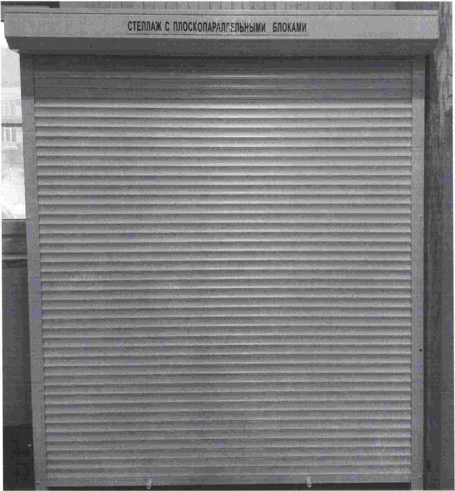
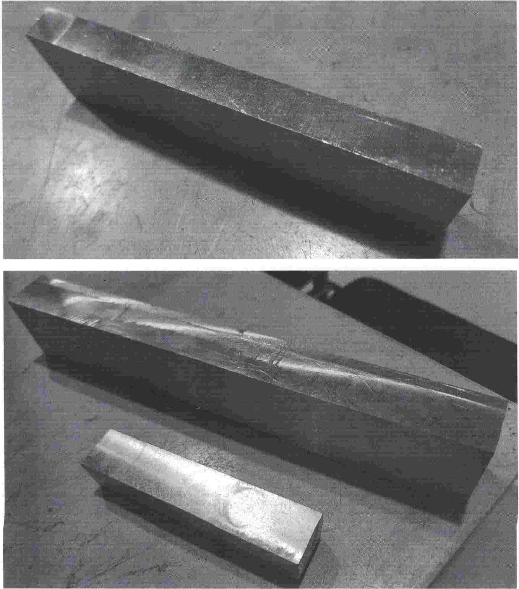
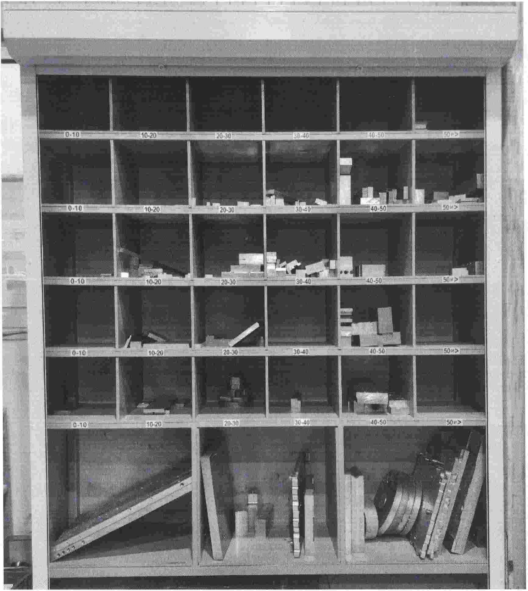

# 📑 Инструктивное письмо

## Использование стеллажа с плоскопараллельными блоками (параллельками)

Данное инструктивное письмо направлено на организацию использования плоскопараллельных блоков (параллелек) на станках с ЧПУ фрезерного участка и распределения их по ячейкам стеллажа для последующего хранения.

---

## ⚙️ Плоскопараллельные блоки (параллельки) фрезерного станка

Оснастка для станков.

Данные приспособления используются для:

* ориентирования детали в станочных тисках параллельно;
* установки детали на заданном расстоянии от базы тисков, в случаях, когда её высота меньше высоты губок.

Параллельки изготавливаются разных размеров и форм:

* специализированные (для конкретного изделия);
* универсальные (подходящие для нескольких видов деталей или операций).

Материал изготовления:

* сталь,
* алюминий.

---

## 🗄 Хранение параллелек

Для удобства хранения и облегчения поиска параллелек при переналадке оборудования на фрезерном участке установлен специальный стеллаж.

Стеллаж имеет ячейки, разграниченные по габаритам параллелек:

* 0–10
* 10–20
* 20–30
* 30–40
* 40–50
* 50 и выше

Дополнительно предусмотрены **3 отсека** для негабаритных подкладок.

---

## 🛠 Порядок работы с параллельками

После изготовления новых или возврата уже готовых параллелек оператору необходимо:

1. удалить все загрязнения;
2. измерить расстояние между рабочими (опорными) поверхностями;
3. поместить параллельки в ячейку с подходящим диапазоном размеров.

Изношенные, забитые или имеющие зарезы на опорных поверхностях параллельки могут быть отремонтированы путём повторного фрезерования до получения требуемой точности.

❌ Если высота параллельки после повторного фрезерования будет недостаточна — параллелька изготавливается заново.

---

## ✅ Ответственные лица

* За порядок на стеллаже ответственность несут **мастера смен фрезерного участка**.
* Ответственный за контроль исполнения данного инструктивного письма: **Синицын А.**
