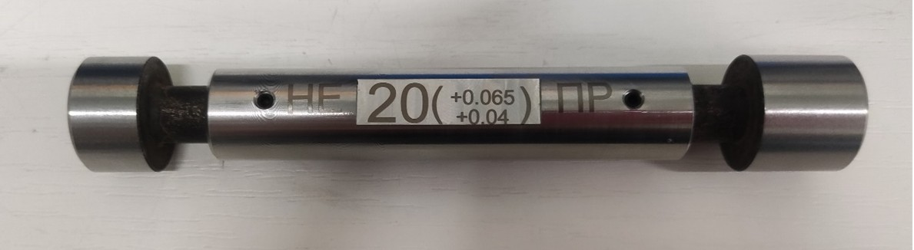
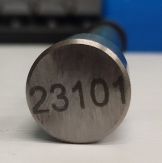
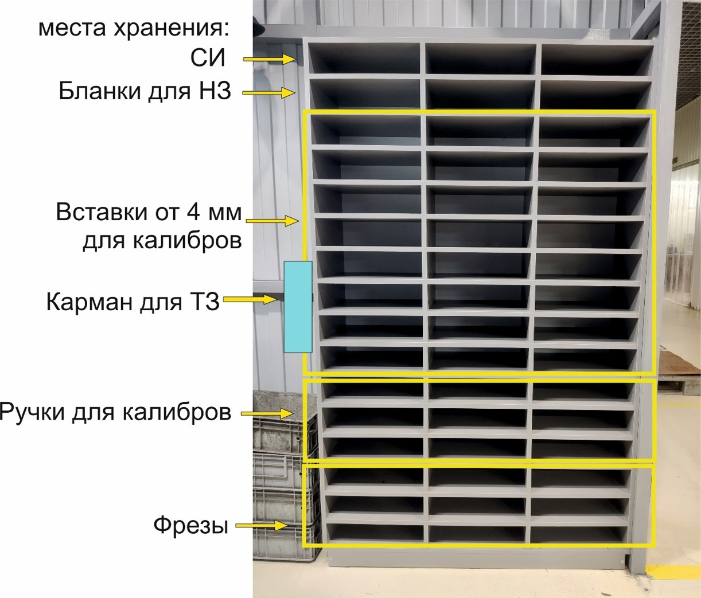

# 📑 Инструктивное письмо

## По изготовлению, работе, хранению и утилизации самодельных калибр-пробок гладких на предприятии «ПФ-ФОРУМ»

Данное Инструктивное Письмо направлено на регламентированное движение самодельных калибр-пробок гладких (далее **СМ КПГ
**), используемых на производстве компании «ПФ-ФОРУМ».

Зачастую СМ КПГ, изготовленные на производстве «ПФ-ФОРУМ», находятся в месте, неизвестном для операторов, контролёров
ОТК и инженеров по метрологии. Они часто теряются на станке, быстро изнашиваются, вовремя не контролируются и
своевременно не утилизируются.

---

## ⚙️ 1. Изготовление СМ КПГ

Изготовление самодельных калибр-пробок гладких для заказчика осуществляется на предприятии «ПФ-ФОРУМ» в случае, если:

* срок поставки от завода-поставщика составляет более **15 дней**,
* либо калибры отсутствуют в наличии на момент заказа.

Решение об изготовлении принимает **инженер-метролог** на стадии проработки или покупки.
Если допуск ниже **Н11 квалитета**, решение согласовывается с **РО4**.
Цены утверждаются с согласования РО4.

---

## ⚙️ 2. Запуск заказа

После попадания заказа в план производства и снятия статуса оплаты:

* в отделе метрологии запускается покупка или изготовление всех нужных калибров;
* если заказ содержит СМ КПГ, инженер-метролог создает **Техническое Задание на СМ КПГ из плана заказов** (*рис.1*).

В ТЗ указываются:

* исполнительные размеры по ГОСТ 21404-75,
* №КП,
* код детали,
* заказчик,
* наименование детали,
* дата заказа,
* срок изготовления.

*(Рис.1 — образец ТЗ на самодельную калибр-пробку)*

---

## ⚙️ 3. Передача ТЗ

* ТЗ передаётся **НО12А** с указанными размерами и датой изготовления.
* НО12А распределяет изготовление калибров на станки или участок заточки (в зависимости от диаметра).
* НО12А отслеживает сроки изготовления.
* ТЗ хранятся в объёмном кармане на **левой стороне стеллажа участка заточки** (*рис.3*).

---

## ⚙️ 4. Фиксация в Google-таблице

Все данные заносятся в **Google-таблицу «ПФ-ФОРУМ Метрология Google-перечень СИ и СК»**, вкладка «Самодельные СК».
Ответственный — инженер по метрологии.

---

## ⚙️ 5. Требования к изготовлению

При изготовлении калибров учитываются правила из ТЗ:

* Для **операторов**:

    * ПР сторона — в наибольшем размере,
    * НЕ сторона — в наименьшем размере.

* Для **ОТК**:

    * ПР сторона — в наименьшем размере,
    * НЕ сторона — в наибольшем размере.

При внеплановом изготовлении инженер-метролог опирается на эти же правила.

---

## ⚙️ 6. Проверка после изготовления

* Оператор или заточник перемещает калибр и ТЗ в коробку **«Для новых самодельных калибров»** на проверку НО13А.
* Коробка расположена на столе в комнате СИ и СК (*рис.2*).

*(Рис.2 — коробка «Для новых самодельных калибров» в комнате СИ и СК)*

---

## ⚙️ 7. Заключение о годности

* ✅ Если калибр соответствует нормативным требованиям — он признается годным.
* ❌ Если не соответствует — возвращается НО12А для изготовления замены (исключения возможны по согласованию с НО13А).

---

## ⚙️ 8. Присвоение инвентарного номера

* После положительного заключения калибру присваивается **инвентарный номер**.
* Номер заносится в Google-таблицу во вкладку **«Гладкие калибры»**.
* Формат номера: **год-месяц-порядковый №** (например, *2309-3*).

---

## ⚙️ 9. Маркировка

* На вставках калибра маркируется инвентарный номер (признак прохождения калибровки).
* На ручке калибра указываются диапазон и логотип.

---

## ⚙️ 10. Хранение

* СМ КПГ хранятся **вместе с заводскими калибрами** в комнате СИ и СК.
* Располагаются на стеллажах в своих номинальных диаметрах.

---

# 🛠 Описание технологического процесса изготовления калибра

### Общая конструкция

СМ КПГ состоят из:

* проходной вставки,
* непроходной вставки,
* ручки.

  
  

**Ручка** — цилиндр с посадочными отверстиями для вставок. На середине расположена площадка под маркировку. Вставки
фиксируются резьбовыми заглушками.

### Виды ручек (нормативный запас)

> 1. Ф 4 мм (20 шт)
> 2. Ф 6 мм (20 шт)
> 3. Ф 8 мм (20 шт)
> 4. Ф 10 мм (20 шт)
> 5. Ф 18 мм (20 шт)

Материал — нержавеющая сталь.

### Вставки

* Делятся на **проходные** и **непроходные**.
* До 8 мм — из твёрдого сплава.
* Свыше 8 мм — из стали **40Х**.

### Группы вставок (с нормативным запасом)

> 1. 0–4 мм (Ø 4 мм) — 10 ПР + 10 НЕ
> 2. 4–6 мм (Ø 6 мм) — 10 ПР + 10 НЕ
> 3. 6–8 мм (Ø 8 мм) — 10 ПР + 10 НЕ
> 4. 8–18 мм (Ø 8 мм) — 10 ПР + 10 НЕ
> 5. 18–26 мм (Ø 10 мм) — 10 ПР + 10 НЕ
> 6. 26–60 мм (Ø 18 мм) — 5 ПР + 5 НЕ
> 7. Свыше 60 мм — изготавливаются на станке

### Технология изготовления вставок

* Изготавливаются на токарном станке с припуском 0.5 мм.
* Проходят термообработку.
* Шлифуются «в размер» на заточном станке.
* Хранятся на **стеллаже участка заточки инструмента** (*рис.3*).

*(Рис.3 — стеллаж участка заточки инструмента для хранения ТЗ и вставок)*

---

# 📑 Контроль нормативного запаса

* Один раз в конце месяца заточник подает **заявку НО12А** на пополнение НЗ.

Форма заявки:

| Диаметр | Тип (вставка/ручка) | Количество |
|---------|---------------------|------------|
|         |                     |            |
|         |                     |            |

* Бланки НЗ хранятся на участке заточки.
* Ответственный за наличие запаса — **НО12А**.
* Ответственный за контроль исполнения ИП — **начальник метрологической службы и СМК**.
