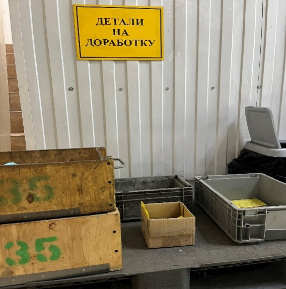
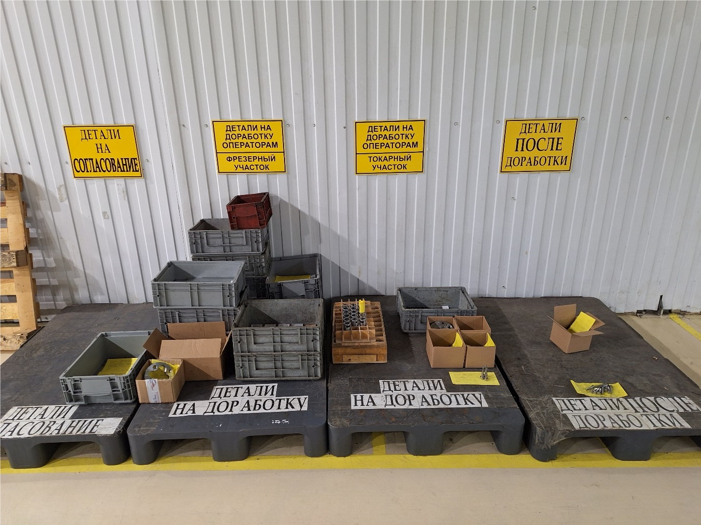

# Доработка деталей при выявлении отклонений от КД

Данное Инструктивное Письмо направлено на своевременную доработку изделий с отклонениями от КД после выхода их со
станков с ЧПУ.

## 1. Общие положения

При обработке изделий на станках периодически происходят ситуации, когда детали выходят с отклонениями от КД.

* В результате анализа выявленных отклонений принимаются решения:

    * по их согласованию,
    * доработке на слесарном участке,
    * доработке оператором вручную,
    * доработке на станке ЧПУ.

## 2. Принятие решений

📑 Ежедневно в 9:00 РО4 в лаборатории ОТК принимает решение о дальнейшей доработке, согласовании или забраковке данных
изделий.
⚙️ Данное заключение фиксируется на жёлтой бирке.

## 3. Перемещение изделий

Согласно заключению по типу отклонений начальник отдела (НО11А, НО12А, НО12Т, НО12Ф), в чью компетенцию входит данный
вид доработки, перемещает изделия на доработку в специально отведённое место.

* 📍 Специально отведённое место для доработки изделий слесарным способом находится перед входом на слесарный участок (
  Фото 1).

   
  <em>(Фото 1)</em>

  

* 📍 Специально отведённое место с выявленными отклонениями находится в проходе между цехами, напротив участка упаковки (
  Фото 2).

   
  <em>(Фото 2)</em>

## 4. Действия контролёров ОТК

* При проверке изделий на пооперационном или выходном контроле и при выявлении отклонений оформляется жёлтая бирка.
* Данные заносятся в программу СОФТ.
* В соответствии с данными из ЦКП оператора станков с ЧПУ и смены токарного или фрезерного участка вычитается процент
  брака.
* Все записи в программе СОФТ ведутся ежедневно и автоматически попадают в таблицу данных для заседания Совета по
  Качеству.
* При занесении данных оператору станков с ЧПУ автоматически в Телеграм-боте приходит уведомление по виду брака и
  количеству.

🛠 Оператору необходимо:

1. Объяснить в Телеграм-боте причины несоответствий и предложение по недопущению подобных ситуаций.
2. Отсортировать и доработать детали вручную в течение трёх рабочих дней согласно заключению.
3. После доработки переместить изделия на место «Детали после доработки».

✅ ОТК принимает данные детали и убирает процент брака из ЦКП.

❌ В случаях, когда оператор в течение трёх дней **не делает запись** и этому нет объективных причин (отпуск, больничный
и т.д.), браковка деталей ставится **автоматически**.

## 5. Контроль сроков доработки

* 📑 НО11А отслеживает доработку изделий на поддоне `«ДЕТАЛИ НА СОГЛАСОВАНИЕ»` в период **5 рабочих дней** с даты
  отправления письма на согласование.
* 📑 НО12А отслеживает доработку изделий на поддоне `«ДЕТАЛИ НА ДОРАБОТКУ»` на слесарном участке в период **до 3 рабочих
  дней** с даты принятия решения.
* 📑 НО12Т и НО12Ф отслеживают доработку изделий на поддонах `«ДЕТАЛИ НА ДОРАБОТКУ ОПЕРАТОРАМ ТОКАРНОЙ ГРУППЫ»` и `«ДЕТАЛИ
  НА ДОРАБОТКУ ОПЕРАТОРАМ ФРЕЗЕРНОЙ ГРУППЫ»` в течение **3 дней** с даты принятия решения.

## 6. Перемещение доработанных изделий

* Доработанные изделия перемещаются оператором станков с ЧПУ или слесарем на поддон «ДЕТАЛИ ПОСЛЕ ДОРАБОТКИ».
* В случае повторной доработки деталей на слесарном участке изделия также перемещаются на поддон «ДЕТАЛИ ПОСЛЕ
  ДОРАБОТКИ».
* Сотрудники ОТК ежедневно принимают в работу данные детали после доработки.

## 7. Ответственность

Очень важно быстро реагировать и заносить данные в таблицу Совета по Качеству для выявления и предотвращения повторных
ситуаций с отклонениями от КД при обработке изделий.

📌 Ответственность за выполнение данного Инструктивного Письма возлагается на РО4.
