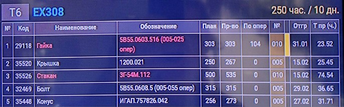

# 📑 Инструктивное письмо

## «По использованию плана изготовления продукции операторами станков с ЧПУ»

В течение работы мы постоянно сталкиваемся с проблемой неправильного определения приоритетов изготовления изделий
согласно плану.

Эта проблема возникает вследствие разных причин:

* ❌ невнимательность операторов станков с ЧПУ;
* ❌ отсутствие навыков работы операторов станков с ЧПУ;
* ❌ отсутствие качественной подготовки производства (нет инструмента, калибров, техпроцессов, управляющих программ);
* ❌ нет возможности изготавливать продукцию на станке из-за его технических характеристик.

Это приводит к незапланированным простоям оборудования, срыву сроков изготовления продукции и, как следствие, увеличению
её себестоимости и потере клиентов.

---

## ⚙️ План изготовления продукции

У операторов станков с ЧПУ фрезерного и токарного участка есть план изготовления продукции, который указан на мониторах
на каждом участке (см. Таблицу №1).

  
 
<em>Таблица 1</em>

Каждый станок имеет своё обозначение (например, **EX-308**) и свой порядковый номер (например, **T6**).

Далее по линии указано время спланированных операций на данном станке в часах и сутках.

### На каждом станке указаны:

* порядковый номер изделия, которые необходимо изготовить,
* код для идентификации детали,
* наименование,
* обозначение,
* план в шт. (необходимое минимальное изготовление изделий для выполнения заказа),
* *в производстве* — количество запущенных изделий на данный момент времени,
* номер операции данного изделия (**005–025** и т.д.),

    * токарно–фрезерная операция — подсвечивается **бледно-жёлтым** цветом,
    * токарная операция — **без подсветки**,
* готовность предыдущей операции — подсвечивается **жёлтым цветом**,
* дата, когда изделие должно быть отгружено,
* **Тшт. (мин)** — время, заложенное на изготовление одной единицы изделия на данную операцию.

    * *Примечание:* Тшт на мониторе отличается от Тшт в маршрутном листе, так как включает время наладки всей партии,
      делённое на количество изделий в партии. В маршрутном листе наладка выводится отдельно и не учитывается в Тшт,
* **Тпр. (часы)** — время, необходимое для полного производства всего запланированного количества изделий на данной
  операции.

---

## 🎨 Система подсветки

* ✅ **Зелёный цвет** — изделия, имеющие приоритет над другими (при этом последовательность выполнения сохраняется).
* 🟧 **Оранжевый цвет** — изделия, запланированные к отгрузке в отчётную неделю (с **среды по вторник включительно**).
* ⚪ **Белый цвет** — изделие изготавливается согласно плану.
* 🔴 **Красный цвет** — изделия, которые производство не успевает отгрузить в назначенное время.

---

## 🛠 Правила изменения приоритетности

Отмена или смена приоритетности изготовления запланированных изделий возможна **только** после координации **НО12А** с
мастером смены или наладчиком.

---

## 📌 Подготовка производства

Для снижения времени простоя оборудования оператору станков с ЧПУ **ежедневно** совместно с мастером смены и наладчиком
вахты необходимо производить подготовку производства на **1–2 суток вперёд**:

* инструмент,
* оснастка,
* калибры,
* программы и т.д.

---

## ✅ Отметка выполнения операций

После выполнения каждой операции оператор станков с ЧПУ, наладчик или мастер смены (кто работал на данном станке) обязан
отметить в программе **СОФТ** выполнение данной операции.

Далее необходимо заполнить все графы маршрутной карты.

---

## 📑 Цель инструктивного письма

Данное инструктивное письмо направлено на:

* оптимизацию работы операторов станков с ЧПУ, мастеров смен и наладчиков;
* упорядочение постановки изделий на станки;
* искоренение простоев и срывов сроков изготовления продукции предприятия компании **ООО «ПФ-ФОРУМ»**.
