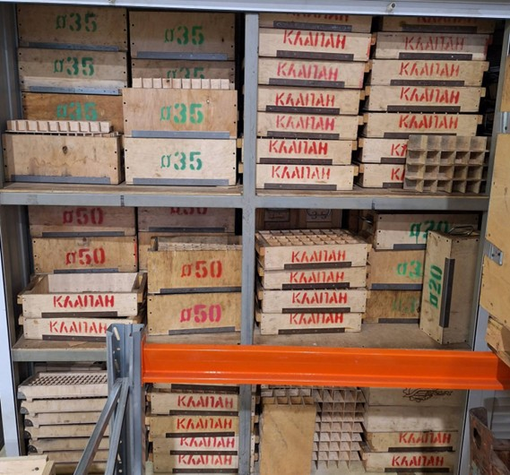
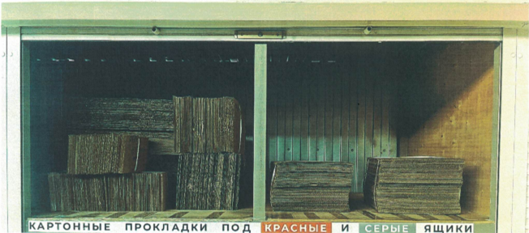
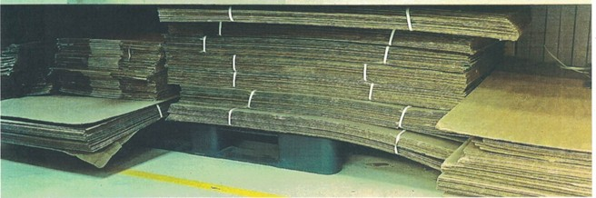

# 📑 Инструктивное письмо

## По транспортировке продукции по цеху в деревянной или специальной таре

### ⚙️ Общие положения

В процессе производства готовой продукции сотрудники предприятия постоянно сталкиваются с таким видом брака, как
замятины, забоины и царапины.
Эта проблема возникает вследствие неправильной транспортировки изделий операторами станков с ЧПУ и слесарями.

### ❌ Последствия нарушений

* Дефекты на деталях приводят к необходимости их доработки на станках или слесарном участке (если это возможно).
* Возможна окончательная забраковка изделий.
* Возрастает себестоимость производства.
* Увеличивается загруженность станков и слесарного участка.
* Снижается прибыль производства.
* Возникают срывы сроков отгрузки деталей заказчику.

### ✅ Правила транспортировки изделий

Все перечисленные ниже изделия необходимо транспортировать только:

* в **специальной деревянной таре** (из-под пробки или клапанов),
* в **воздушно-пузырчатой плёнке** (если это указано в ТП).

Категории изделий:

* изделия из мягких сплавов и металлов (латунь, бронза, нержавеющая сталь, дюраль, органический пластик);
* изделия со сложной конфигурацией;
* изделия с тонким исполнением;
* изделия с большими вылетами;
* изделия с высокими допусками чистоты обработки *(Ra 1,6-0,8; Ra 0,4)*;
* изделия с предварительной окраской, покрытием, тонкими наружными резьбами.

### 🛠 Материалы и место хранения

* Материалы для транспортировки хранятся в **зоне входящей продукции**, справа от прохода на фрезерный участок.
  *(Смотри фото 1)*

### 📦 Особые случаи транспортировки

1. Если габариты изделия не помещаются в деревянную тару → использовать **пластиковые ящики с прокладками** между слоями
   и изделиями.

    * Прокладки находятся на **третьем закрытом стеллаже**, напротив места складирования пластиковых поддонов, красных и
      серых ящиков.
      *(Смотри фото 2)*

2. Крупногабаритные изделия транспортируются на **пластиковом поддоне**.

    * На основание поддона необходимо уложить **картонную прокладку**.
    * Между изделиями также должны быть проложены прокладки.
    * Прокладки для пластиковых поддонов находятся **на участке упаковки**.
      *(Смотри фото 3)*
   

### 🧹 Подготовка тары и изделий

Перед укладкой:

* тару необходимо **продуть и очистить**;
* изделия необходимо **продуть от СОЖ и очистить**, удалить стружку.

### 🚫 Запрещено

* складывать детали в картонные коробки;
* кидать изделия перед укладкой;
* использовать сырой и грязный картон;
* складировать более 1 изделия в ячейку;
* допускать наличие грязи и стружки в ячейке и на изделии.

📑 Настоящее инструктивное письмо направлено на полное исключение брака (замятины, забоины, царапины и др.) на деталях
производства компании **ООО «ПФ-ФОРУМ»**.
