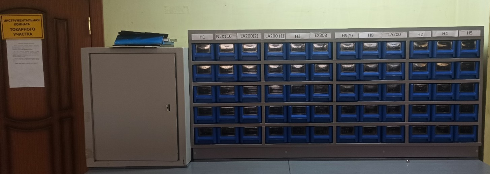

# Инструктивное письмо

## По использованию зоны подготовки металлорежущего инструмента для работы на станках с ЧПУ токарного участка

### ⚙️ Проблема

При подготовке производства к переналадкам и работе в ночные смены возникает следующая ситуация:

* Операторы станков с ЧПУ ночной смены не могут найти подготовленный для работы металлорежущий инструмент.
* Инструмент может находиться:

    * в ящике с деталями,
    * на столе у станка,
    * либо его забыли подготовить.

### ✅ Решение

Для устранения указанной проблемы:

* организована зона подготовки металлорежущего инструмента,
* разработаны правила по работе с ней.

📍 Зона расположена около инструментальной комнаты токарного участка в основном цеху.

### 🛠 Организация зоны хранения

* Шкаф разделён на **12 столбцов**, каждый соответствует определённому станку (обозначение на табличке сверху).
* Для каждого станка предусмотрено **5 ячеек хранения**.
* На каждой ячейке размещена бирка с названием детали и номером операции.

### 📑 Назначение ячеек

1. **Нижняя ячейка**

    * предназначена для подготовки инструмента для ночной смены;
    * включает инструмент, необходимый для изготовления деталей, уже налаженных на станке;
    * ответственность несёт оператор дневной смены, изготавливающий данные изделия.
    * оператор обязан:

        * самостоятельно набрать инструмент на текущие детали для сменщика,
        * положить инструмент в соответствующую ячейку.

2. **Оставшиеся 4 ячейки**

    * предназначены для инструмента, необходимого для переналадки станка по плану производства;
    * ответственность за их заполнение несут наладчик и мастер смены токарного участка.
    * сотрудник, заполняющий ячейку инструментом, обязан заполнить **чек-лист**.

# 📑 Лист подготовки производства

## 🛠 Основные данные

| Поле             | Значение                    |
|------------------|-----------------------------|
| Наладчик         | Дмитриев А.                 |
| Станок           | TAKISAWA NEX-110            |
| Дата подготовки  | 15.02.2024                  |
| Деталь           | ВТУЛКА 123456.              |
| № ОП.            | 010оп.                      |
| Наличие калибров | есть                        |
| Наличие УП       | есть                        |
| Номер УП         | O1234                       |
| Отработанная     |                             |
| Неотработанная   | В папке неотр. От наладчика |

## 🔧 Подготовлен инструмент

| №  | Резец, фреза, сверло и т.п.       | Кол-во | Пластина          | Кол-во |
|----|-----------------------------------|--------|-------------------|--------|
| 1  | черновой проходной треугольный №1 | 1      | WNMG080408 WS1234 | 2      |
| 2  | чистовой проходной рыбка 35 гр №6 | 1      | VBMT160404 WS1234 | 2      |
| 3  | резьбовой проходной №2            | 1      | 16ER 175ISO       | 1      |
| 4  | сверло кобальтовое ф9.2           | 3      |                   |        |
| 5  | сверло центровочное ф12           | 2      |                   |        |
| 6  | расточной резец ф12 №16           | 2      | CCMT060404 YBG205 | 2      |
| 7  |                                   |        |                   |        |
| 8  |                                   |        |                   |        |
| 9  |                                   |        |                   |        |
| 10 |                                   |        |                   |        |
| 11 |                                   |        |                   |        |
| 12 |                                   |        |                   |        |

## 🔄 Обратная связь о качестве подготовки

| Поле                                                        | Значение                                                                                                                                                    |
|-------------------------------------------------------------|-------------------------------------------------------------------------------------------------------------------------------------------------------------|
| Ф.И.О. наладившего                                          | Иванов И.И.                                                                                                                                                 |
| Наличие необходимого инструмента                            | всё в наличии                                                                                                                                               |
| Наличие управляющей программы                               | всё в наличии                                                                                                                                               |
| Недочёты и ошибки в программе                               | 1. В программе на чистовой резец стояло слишком много оборотов — убавили. 2. Фаска 1×45 получилась меньше — корректировали.                              |
| Наличие комментариев к инструменту и соответствие программе | соответствует                                                                                                                                               |
| Общая оценка подготовки                                     | удовлетворительно                                                                                                                                           |
| Рекомендации                                                | уделить внимание правильности написания фасок; при отработке пластина VBMT160404 WS1234 не давала необходимую шероховатость — заменили на VBMT160404 YBG205 |

### 🔄 Обратная связь

* Оператор станков с ЧПУ, выполнявший наладку детали, заполняет графу **«Обратная связь о качестве наладки»**.
* Это необходимо:

    * чтобы наладчик (инженер) учитывал недочёты и не повторял их,
    * чтобы при повторной наладке специалисты имели актуальные данные по подготовке.

### 📌 Контроль

* Ежедневно **НО12Т** проверяет:

    * актуальность расположения ячеек в соответствии с планом,
    * их наполнение.

### ❌ Ответственность

* За выполнение данного Инструктивного письма ответственность возлагается на **НО11Т**.
