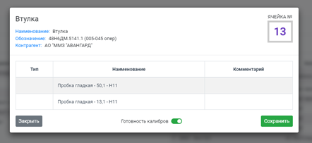
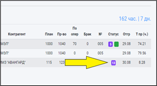
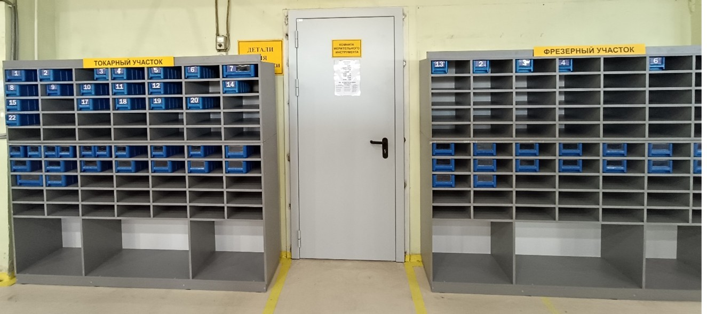
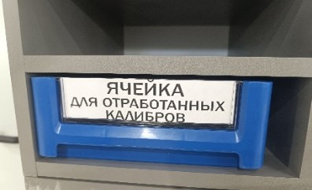
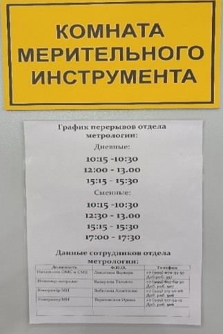

# 📑 Инструктивное письмо

## По работе раздаточной комнаты мерительного инструмента на производстве компании ООО «ПФ-ФОРУМ»

Данное Инструктивное письмо направлено на регламентированное движение, правила выдачи, сдачи калибров и измерительных
приборов, используемых на производстве компании ООО «ПФ-ФОРУМ».

## ⚙️ Правила работы раздаточной комнаты мерительного инструмента (МИ)

### 1. Подготовка МИ

Контролёр МИ подготавливает мерительный инструмент согласно перечню программы СОФТ, который заложен на данную деталь по
операциям.

### 2. Присвоение номера

Контролёр МИ присваивает номер ячейки и ставит отметку, что МИ подготовлен. Для операторов на основном экране в цехе
высвечивается готовность в виде фиолетового квадрата с номером.

### 3. Хранение ячеек

Подготовленная для оператора пронумерованная ячейка хранится на стеллаже готового МИ.

* Стеллажи разбиты по участкам.
* Нумерация ячеек идёт на увеличение.

### 4. Получение ячейки оператором

Оператор смотрит на основном экране номер ячейки, находит нужную на стеллаже и забирает её на станок.

* Калибры хранятся в ячейке и передвигаются вместе с ней.
* Нумерация и готовность ячейки остаётся на экране до окончания операции.
* После завершения работы оператор возвращает ячейку со всем содержимым МИ.

### 5. Возврат ячеек

Возврат ячейки может осуществляться двумя способами:

* Каждое утро сотрудник отдела метрологии обходит станки и собирает ненужный МИ с ячейками.
* На стеллаже выделены места **красным цветом** под ячейки для отработанных калибров.

### 6. Случай отсутствия калибра

Если калибры не требуются для изготовления детали, контролёр МИ оставляет позицию нетронутой и в графе «номер ячейки»
ставит ноль.
➡️ На основном экране в цехе появляется фиолетовый квадрат с нулем.

### 7. Особые ситуации при работе с калибрами

Может возникнуть ситуация, когда калибр не заложен, но требуется оператору:

* ✅ Если калибр в наличии — контролёр МИ вносит запись в таблицу отклонений для технологов (с указанием Ф.И.О. оператора
  и потребности) и выдаёт калибр.
* 🛠 Если калибра нет — контролёр подбирает ближайший по квалитету, согласовывает с НО12Т или НО12Ф, фиксирует в таблице
  отклонений и выдаёт оператору.
* ❌ Если нет подходящего калибра — решение принимает мастер смены: снимать ли детали со станка или измерять другим МИ.
  Далее информация передаётся начальнику участка и НО13А. При необходимости оформляется заявка на закупку МИ.
* 🚨 В форс-мажорной ситуации мастерам смен разрешено заходить в комнату после 20:00 с охраной. Для этого необходимо
  оповестить НО13А и заполнить «Пропуск на вход в комнату мерительного инструмента в нерабочее время» (Приложение №1).

### 8. Выдача МИ контролёрам ОТК

* Контролёр ОТК подходит с чертежом.
* Контролёр МИ подготавливает МИ и выдаёт его, сначала проверяя стеллаж ОТК, затем общую базу.
* Информация о выдаче заносится в Google-таблицу «Перечень СИ и СК для МС».

При спорных ситуациях:

* Контролёр МИ перепроверяет калибр, выявляет повреждения, калибрует или подбирает замену.
* Возврат калибров — в ячейки, выделенные красным цветом.

### 9. Выдача МИ слесарям

* Слесарь обращается с чертежом или биркой отклонения.
* Контролёр МИ подготавливает и выдаёт МИ, фиксируя данные в Google-таблице «Перечень СИ и СК для МС».
* Слесарю выдаётся калибр с наибольшим предельным размером.

При спорных моментах:

* Контролёр МИ перепроверяет калибр, оценивает повреждения, калибрует или заменяет его.
* Возврат — в специальные ячейки, выделенные красным цветом.

### 10. Доступ в раздаточную комнату

Если контролёр МИ занят, сотрудники ждут.
🚫 Самостоятельно проходить к стеллажам и искать калибры запрещено.
👥 В комнате одновременно допускается не более 2 сотрудников и контролёр МИ.

### 11. Выдача специальных мер

* Концевые меры длины (КМД), установочные меры, кольца, вставки и насадки для штангенциркулей и микрометров выдаются под
  роспись.
* Если требуется оставить для следующей смены, оператор обязан перезаписать их на себя.
* Для ночной смены перезапись осуществляется утром.

### 12. Режим работы

* Комната работает с 8:00 до 20:00.
* В остальное время она заперта.
* Все вопросы по ночным наладкам решаются <u><b>заранее</b></u>.
* В случае отсутствия контролёра МИ на двери указаны перерывы и телефоны сотрудников.
  

### 13. Обращение по дополнительным вопросам

Сотрудники могут обращаться к контролёру МИ (кроме перерывов) по вопросам:

* настройки прибора,
* калибровки калибра,
* замены батарейки,
* чистки прибора или калибра,
* помощи в подборе МИ.

## 🛠 Ответственный за исполнение

За контроль исполнения данного ИП ответственным должностным лицом является начальник метрологической службы и СМК.

## 📘 Глоссарий

* **МИ** – мерительный инструмент (калибры и средства измерения).
* **Перечень СИ и СК** – перечень средств измерений и средств контроля.

# 📑 Приложение №1

### «По работе раздаточной комнаты мерительного инструмента на производстве компании ООО «ПФ-ФОРУМ»

## БЛАНК

### «Пропуск на вход в комнату мерительного инструмента в нерабочее время»

**Дата:** \_\_\_\_\_\_\_\_\_\_\_\_\_\_\_\_\_\_
**Время:** \_\_\_\_\_\_\_\_\_\_\_\_\_\_\_\_\_

**Мастер:** \_\_\_\_\_\_\_\_\_\_\_\_\_\_\_\_\_\_ участка, смены № \_\_\_\_\_\_\_

**Ф.И.О.:** \_\_\_\_\_\_\_\_\_\_\_\_\_\_\_\_\_\_\_\_\_\_\_\_\_\_\_\_\_\_\_\_\_\_\_\_\_\_\_\_\_\_\_\_\_\_\_\_\_\_\_\_\_\_\_\_\_\_\_\_\_

### СИТУАЦИЯ

*(нестандартная, сложная или требующая немедленного решения)*

---

---

---

---

### ДАННЫЕ ДЕТАЛИ

| Код / № партии | Номенклатура | Обозначение | Контрагент |
| -------------- | ------------ | ----------- | ---------- |
|                |              |             |            |
|                |              |             |            |

---

### ДАННЫЕ МЕРИТЕЛЬНОГО ИНСТРУМЕНТА, которые взяли

| Наименование МИ | Заводской № | Метрологические характеристики (диапазон, квалитет) |
| --------------- | ----------- | --------------------------------------------------- |
|                 |             |                                                     |
|                 |             |                                                     |
|                 |             |                                                     |
|                 |             |                                                     |
|                 |             |                                                     |

---

**Подпись мастера смены:** \_\_\_\_\_\_\_\_\_\_\_\_\_\_\_\_\_\_\_\_\_\_\_\_\_\_\_\_\_

Проверено и подтверждено сотрудником службы безопасности, что написанное соответствует действительности *(Наименование мерительного инструмента, заводской №).*

Подтверждаю, что присутствовал при открытии комнаты и находился при поиске нужного мерительного инструмента.

**Ф.И.О.:** \_\_\_\_\_\_\_\_\_\_\_\_\_\_\_\_\_\_\_\_\_\_\_\_\_\_\_\_\_\_\_\_\_\_\_\_
**Подпись:** \_\_\_\_\_\_\_\_\_\_\_\_\_\_\_\_\_\_\_\_\_\_\_\_\_\_\_\_\_\_\_\_\_\_\_
*(сотрудник службы безопасности)*
