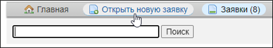
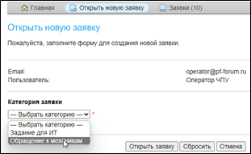
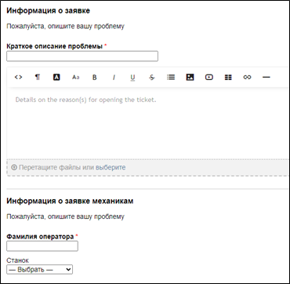
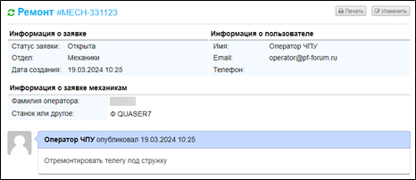

# Инструкция по оформлению заявок операторами станков с ЧПУ для службы механиков

В случаях возникновения неисправностей и неполадок в работе оборудования и для их последующего оперативного устранения
на рабочих компьютерах операторов станков с ЧПУ созданы ярлыки для заявок в отдел Технического Обеспечения и Подготовки
Производства (далее — отдел ТО и ПП).

При возникновении неисправности оператору необходимо:

1. ⚙️ Поставить в известность мастера смены.
2. ✅ Занести заявку по инструкции, приведённой ниже.

## Порядок действий

### 1. Запуск ярлыка

* Запустить ярлык на рабочем столе:

### 2. Создание новой заявки

* Открыть **новую заявку**.

### 3. Выбор категории

* Указать категорию: **обращение к механикам**.

### 4. Заполнение информации по заявке

Обязательные поля:

* 📝 Краткое описание проблемы
* 📄 Полное описание проблемы
* 👤 Фамилия оператора
* 🔧 № станка

### 5. Подтверждение заявки

* Дождаться **создания заявки**.

### 6. Завершение работы

* По завершению **закрыть окно браузера** (или вкладку).

## Контакты 🛠

По техническим вопросам обращаться:

* в **IT-отдел**,
* или в **Телеграм-чат «Электронная маршрутка»**.
