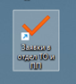
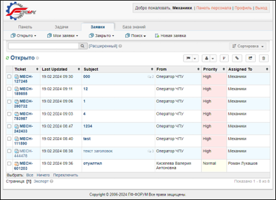
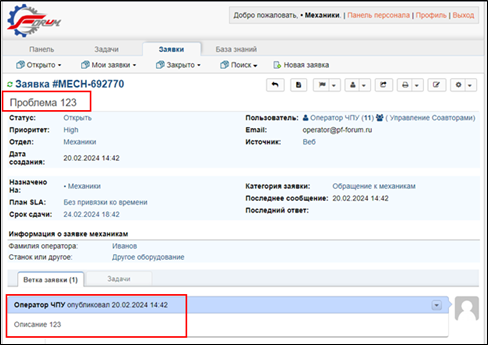
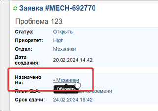
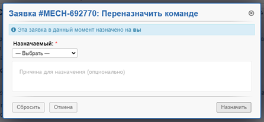
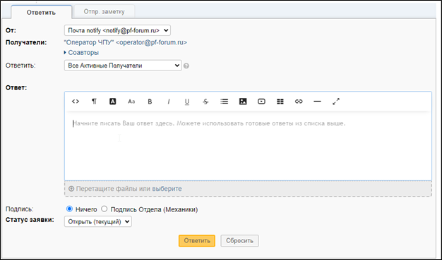
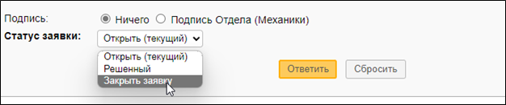

# Инструкция

«По работе службы механиков с заявками от операторов станков с ЧПУ»

В случаях возникновения неисправностей и неполадок в работе оборудования и для их последующего оперативного устранения
на рабочих компьютерах операторов станков с ЧПУ созданы ярлыки для оформления заявок в отдел Технического Обеспечения и
Подготовки Производства (далее — отдел ТО и ПП).

## Действия оператора при возникновении неисправности

1. ⚙️ Поставить в известность мастера смены.
2. 📑 Занести заявку по определённой инструкции.

Служба механиков, получив заявку:

* делает отметку в программе **СОФТ** о получении и запуске устранения неисправности в свой рабочий график;
* после устранения неполадки делает пометку в программе **СОФТ** о закрытии неисправности.

---

## Как формировать заявку

### 1. Запуск ярлыка

🔗 Запустить ярлык на рабочем столе:

### 2. Список заявок

📑 Просмотреть доступные заявки.

### 3. Заявка и работа с ней

🛠 Внести описание и комментарий по заявке.

### 4. Назначение заявки

⚙️ Определить назначение и ответственного за выполнение.

### 5. Написать ответ по заявке

✍️ Оформить ответ в системе.

### 6. Закрытие заявки

✅ По завершению работы закрыть заявку.

