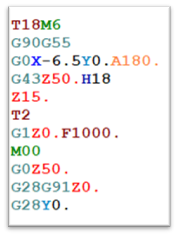

# 📑 Правила движения управляющей программы на производстве компании ООО «ПФ-ФОРУМ»

На фрезерном и токарном участке с ЧПУ при наладке изделий, которые уже изготавливались на предприятии, часто возникает
проблема, связанная с отсутствием отработанной управляющей программы (УП).
Это приводит к потере времени при повторной наладке данных деталей: приходится заново писать программу, отрабатывать её
и подбирать режимы резанья. В результате — простои оборудования, увеличение времени изготовления одной детали (tшт),
рост себестоимости изделий и снижение прибыли компании.

В связи с этими потерями разработаны общецеховые **Правила движения управляющей программы на производстве**.

## 1. Создание и сохранение УП при первом запуске

✅ При первом запуске в производство новых деталей или отдельной операции:

* Технолог-программист или инженер токарного участка составляет УП для обработки на станке с ЧПУ.
* УП необходимо сохранить в папку на сервере — **«Не отработанные УП»**.
* Технолог-программист указывает номер УП в **техпроцессе**, инженер токарного участка — в **листе подготовки
  производства**.

## 2. Стандартизированное оформление вспомогательной информации

### 2.1. Управляющая программа для фрезерного участка

```
O3947 (VKLADYSH_ZATVORA_M_2_11_OP005)
(DATE: 5-NOV-2024 16:35:10)
(STOCK: 43 * 24 * 24)
```

**Первая строка:**
```O3947 (VKLADYSH_ZATVORA_M_2_11_OP005)```


* `O3947` — номер УП.
  ⚠️ Первый символ — английская буква «О», далее четыре цифры (от `0001` до `7999`). Номер выше `7999` использовать
  запрещено.
  Эти символы должны соответствовать **названию файла УП**.
* `VKLADYSH_ZATVORA_M_2_11` — наименование детали.
* `OP005` — номер операции.

**Вторая строка:**

```(DATE: 5-NOV-2024 16:35:10)```

* дата создания УП либо дата её корректировки.

**Третья строка:**

```(STOCK: 43 * 24 * 24)```

* размер заготовки.

**Далее:** список режущего инструмента (номер в УП, описание, параметры).

```
(T1–FREZA.D50X90X4.PLAST.CHERN.D50.R0.4.L32.8.ZMIN=-4.01)
(T2–FREZA.D50X90X4.PLAST.CHIST.D50.R0.4.L32.8.ZMIN=3.91)
(T3–FREZA.D12.KONC.CHIST.D12.L35.ZMIN=-5.)
(T4–FREZA.D10.SFERA.D10.R5.L35.ZMIN=-0.087)
(T5–FREZA.D4.HVOST-D6.CHERN.D4.L20.ZMIN=-2.97)
(T6–FREZA.D3.HVOST-D4.UDLIN.SERIA.CHIST.D3.L19.2.ZMIN=-2.97)
(T7–CENTROVKA.D5.D5.R90.L32.8.ZMIN=-5.6)
(T8–SVERLO.D3.5.D3.5.R118.L35.ZMIN=-5.962)
(T9–SVERLO.D2.5.D2.5.R118.L35.ZMIN=-9.706)
(T10–FREZA.D2.5.HVOST-D4.CHERN.D2.5.L113.55.ZMIN=-2.04)
(T11–FREZA.D3.SFERA.HVOST-D4.CHERN.D3.R1.5.L14.9.ZMIN=-2.319)
(T12–FREZA.D3.SFERA.HVOST-D4.CHIST.D3.R1.5.L14.9.ZMIN=-2.319)
(T13–FREZA.D1.5.HVOST-D4.CHERN.D1.5.L20.ZMIN=-3.26)
(T14–FREZA.D1.5.HVOST-D4.CHIST.D1.5.L20.ZMIN=-3.21)
(T15–FASOCHNIK.D4X90GR.D4.R90.L23.ZMIN=-0.27)
(T16–FREZA.D2.5.HVOST-D4.CHIST.D2.5.L113.55.ZMIN=-3.)
(T17–FREZA.D4.HVOST-D4.UDLIN.SERIA.OTREZ.D4.L30.ZMIN=-7.83)

```

🛠 Эта информация помогает:

* слесарю-инструментальщику правильно подготовить инструмент;
* оператору станков с ЧПУ безошибочно загрузить его в магазин станка.

⚠️ Номера инструментов в списке должны совпадать с номерами в УП.
При изменении или добавлении инструмента оператор обязан **внести корректировки в список**.

<div style="display: flex; align-items: center; gap: 20px;">
 
 <div>
❌ Пример неправильного оформления: отсутствует комментарий, что это за инструмент.
 </div>
</div>

### 2.2. Управляющая программа для токарного участка
```
%
O2804 (SHTUCERSCREW.117-00B 005)
(DATE: 30.01.2025)
```

**Первая строка:**

* `О2804` — номер УП (аналогично ограничению `0001–7999`).
*  Первый символ — это английская буква «О», а затем четыре цифры от `0001` до `7999`. Номер выше `7999` использовать запрещено.
* `STUCER SCREW.117-008` — наименование детали.
* `005` — номер операции.

**Вторая строка:**

* `(DATE: 30.01.2025)` — дата создания или корректировки УП.

**Далее:** список режущего инструмента с описанием и параметрами.

```
(PROHODNOY CERNOVOY WNMG080404-HA K10)
(PROHODNOY CISTVIY DCGT11T304-AL K10)
(PROHODNOY REZBOVOY 16 ER 0.75 ISO LDA)
(PROHODNOY KFNAVOCHNIY ZTBD02002-MM YB9320)
(FREZA.D8 D8 R0)
(FREZA.D8 D8 R0)
(FASOCHNIK.D4X90GR D4 A90)
(FREZA-SFERA-D1 D1 R0.5)
```

⚙️ Инструмент в револьверную голову можно устанавливать в произвольном порядке.
При добавлении нового инструмента оператор обязан **подписать его в УП и скорректировать список**.

```
T0909
G97 S1600 M3
G0 X6 Z5.
M8
G76 P010050 Q50 R0.01
G76 X3.5 Z-5 R0 P495 Q150 F0.5
G0 Z2
G0 G28 U0 W0
M1
```

❌ Пример неправильного оформления: отсутствует комментарий, что это за инструмент.

## 3. Отработка управляющей программы

* В процессе отработки УП могут вноситься корректировки.
* После достижения качества и точности изделий, соответствующих конструкторской документации и технологическому
  процессу, УП считается **отработанной**.
* Отработанная УП сохраняется и используется при повторной наладке.

## 4. Порядок сохранения УП

### 4.1. Запрос в ЭМЛ

* Запрос на сохранение УП формируется **электронным маршрутным листом (ЭМЛ)** автоматически при его заполнении
  оператором.
* Появляется всплывающее окно, куда оператор должен загрузить УП со стойки ЧПУ.
* Если УП не помещена — ЭМЛ не сохраняется.

### 4.2. Передача по почте

* УП автоматически отправляется на почту «токарный участок» или «фрезерный участок».
* Сопроводительная информация:

    * контрагент;
    * наименование и обозначение детали;
    * код и номер партии;
    * номер операции;
    * ФИО оператора;
    * дата;
    * название станка (из ЭМЛ).

### 4.3. Сохранение в папку «ЭТАЛОН»

* Ответственное лицо в течение рабочего дня сохраняет программы в папку **"ЭТАЛОН"**.

### Условия для всплывающего окна в ЭМЛ

* 🆕 Отработка новой детали — даже при незавершённой наладке.
* 📑 Изменение в КД или ТП — для актуализации изменений.
* ⏱ Изменение tшт (в любую сторону).
* 📦 Готовность 80% партии деталей — для контроля внесённых изменений.

    * Если УП не успевает сохраниться, оператор может **переложить обязанность на сменщика**.
    * У сменщика ЭМЛ потребует сохранения при регистрации смены.
* 📌 По требованию технолога-программиста / инженера.

## 5. Ответственный за исполнение

Ответственным за исполнение настоящего Инструктивного письма является **РО4**.
