# 📑 Регламент

## «По использованию инструментальной комнаты токарной группы в производстве компании ООО «ПФ-ФОРУМ»

## Оглавление

1. Введение
    + 1.1. Назначение инструментальной комнаты
    + 1.2 Область применения данного регламента
    + 1.3 Программа СОФТ по учёту расхода инструмента
2. Устройство инструментальной комнаты
    + 2.1 Органайзер вспомогательной оснастки
    + 2.2 Колона переходных втулок и цанг
    + 2.3 Витрины с резцами
    + 2.4 Держатели с корпусными сверлами
    + 2.5 Полки с не твердосплавными сверлами
    + 2.6 Твердосплавные сверла
    + 2.7 Стойки с метчиками и микрорезцами
    + 2.8 Стойка с задними центрами
    + 2.9 Полка с блоками резцедержателей
3. Обязанности сотрудников по работе с инструментальной комнатой
    + 3.1 Слесарь - инструментальщик
    + 3.1.1. Прием инструмента и вспомогательной оснастки с ночной смены.
    + 3.1.2 Переборка инструмента
    + 3.1.3 Переборка пластин
    + 3.1.4. Выдача инструмента и учет
    + 3.1.5. Обход и сборка отработанного инструмента
    + 3.2 Оператор станков с ЧПУ
    + 3.3 Мастер смены токарного участка
    + 3.4 Наладчик, инженер
    + 3.5 Начальник отдела обеспечения и подготовки производства

## 1. Введение

### 1.1 Назначение инструментальной комнаты. ⚙️

* Для обеспечения токарного участка необходимым исправным стандартным металлорежущим инструментом и вспомогательной
  оснасткой к станкам.
* Для учёта расхода металлорежущего инструмента на токарном участке и поддержания нормативного запаса этого инструмента.
* Для получения более точного прогноза расхода на стадии просчёта и закупки инструмента, а также для корректировки
  предыдущих закупок с целью снижения расходов на металлорежущий инструмент.

### 1.2 Область применения данного регламента. 📑

Данный регламент предназначен для:

* слесаря-инструментальщика,
* наладчика,
* инженера,
* мастера смены,
* оператора,
* начальника отдела обеспечения и подготовки производства.

### 1.3  Программа СОФТ по учёту расхода инструмента. 💻

Данная программа СОФТ предназначена для учёта расхода инструмента на каждую деталь, производимую на нашем производстве.
При выдаче металлорежущего инструмента слесарю-инструментальщику необходимо заносить в программу СОФТ кому, на какую
деталь, какую операцию и с какой целью (наладка или просто в текущую работу) он выдает инструмент.

## 2. Устройство инструментальной комнаты

Инструментальная комната состоит из нескольких зон, организованных для быстрого поиска и выдачи необходимого
инструмента, а также вспомогательной оснастки для токарных станков. Так же в ней есть верстак инструментальщика для
проведения ремонта и чистки инструментов, и компьютер для своевременного внесения данных в программу СОФТ.

### 2.1 Органайзер вспомогательной оснастки. 🗂

В данном органайзере расположена вспомогательная оснастка для всех токарных, токарно-фрезерных станков.
Все комплектующие расположены по группам:

* по горизонтали – по видам станков,
* по вертикали – по видам оснастки.

  
  

### 2.2 Колона переходных втулок и цанг. 🔩

Этот инструмент предназначен для хранения и быстрого поиска переходных втулок и цанг.
Все разновидности данных оснасток распределены по группам.
Группы обозначены разными цветами.

  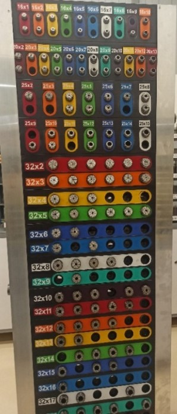
  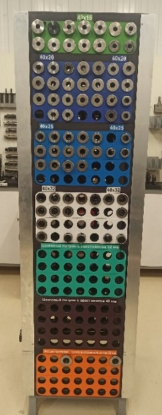

### 2.3 Витрины с резцами. 🧰

На данных витринах расположены часто применяемые на производстве резцы.
Для каждого вида резцов есть своё место, обозначенное табличками с названиями резцов, а также определенным номером.
Данные номера соответственно выгравированы на резцах.

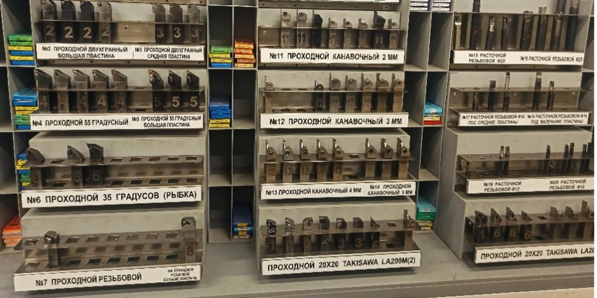

### 2.4 Держатели с корпусными свёрлами. 🛠

В данных держателях расположены корпусные сверла, рассортированные:

* по диаметрам хвостовиков,
* по диаметрам сверловки.

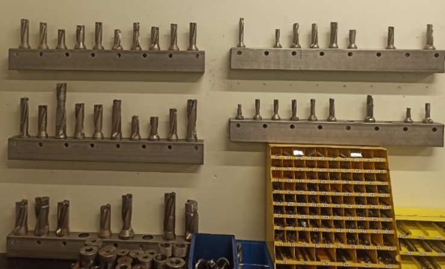

### 2.5 Полки с нетвердосплавными сверлами. 🧱

На этих полках находятся нетвердосплавные сверла стандартной длины:

* от диаметра 1мм до диаметра 12мм с градацией в одну десятую мм (0.1мм),
* от диаметра 12мм до диаметра 20мм с градацией в пять десятых мм (0.5мм).

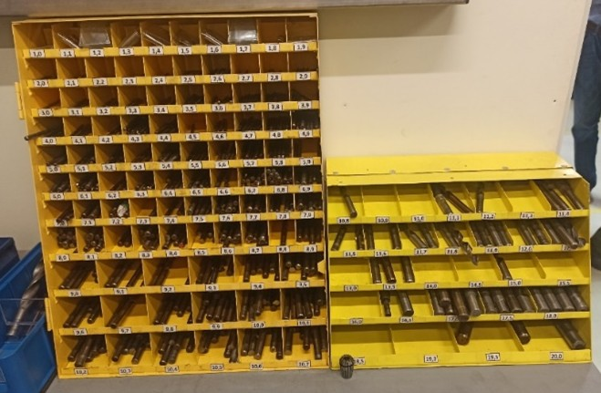

### 2.6 Твердосплавные сверла. ✅

Твердосплавные сверла оператор может получить в инструментальной фрезерной комнате.

### 2.7 Стойки с метчиками и микрорезцами. 🔧

На данной стойке находятся б/у метчики для глухих и сквозных отверстий стандартных параметров от М2 до М12 включительно.

  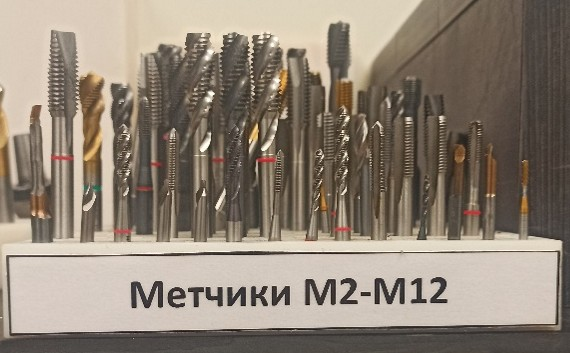

На данной стойке находятся микрорезцы б/у и небольшой запас резцов новых для непредвиденных ситуаций для ночных смен.

  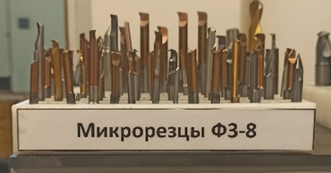

### 2.8 Стойка с задними центрами. 🎯

На данной стойке расположены задние центры.

  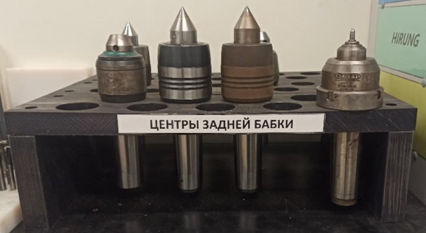

### 2.9 Полка с блоками резцедержателей. 📦

На данной полке расположены все блоки для токарных и токарно-фрезерных станков. Блоки распределены по группам
принадлежности к станкам. Блоки на полках перебраны отремонтированы и укомплектованы к дальнейшей работе.

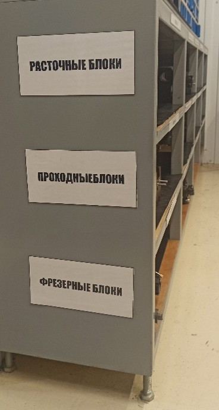
  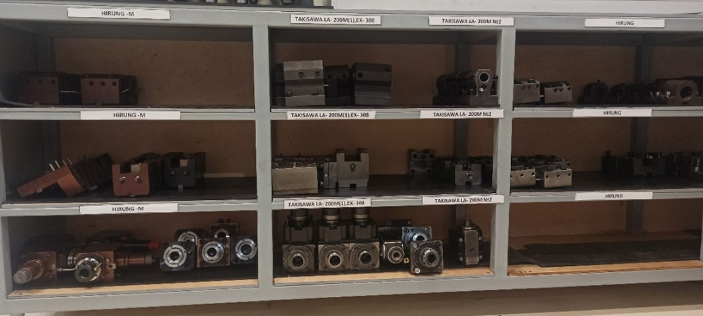

 + Верхний ряд предназначен для расточных блоков. 
 + Средний ряд – для проходных блоков. 
 + Нижний ряд – для фрезерных блоков.

## 3. Обязанности сотрудников по работе с инструментальной комнатой

### 3.1 Слесарь-инструментальщик. 👷

Слесарь-инструментальщик — это работник, обеспечивающий основное правильное функционирование инструментальной комнаты.

**Обязанности:**

#### 3.1.1. Приём инструмента и вспомогательной оснастки с ночной смены. 🌓

В начале своей смены слесарь-инструментальщик принимает с ночной смены инструмент и оснастку, а также ненужные пластины.
Ему необходимо пройти последовательно по станкам и собрать отработанный инструмент и оснастку, параллельно проводя
первичный осмотр резцов на предмет слома. В случае обнаружения слома слесарю-инструментальщику необходимо выяснить
причины и оператора, у которого произошёл слом. Эти данные слесарю-инструментальщику необходимо занести в программу
СОФТ.

#### 3.1.2 Переборка инструмента. 🧽

После сбора инструмента со станков слесарю-инструментальщику необходимо:

* провести проверку и чистку отработанных блоков,
* проверить и почистить, если нужно, все резьбы на блоке,
* прочистить каналы,
* в случае отсутствия каких-либо комплектующих на блоке доукомплектовать их,
* готовый к работе блок необходимо убрать на своё место в комнате.

Далее слесарю-инструментальщику необходимо провести проверку металлорежущего инструмента. Ему необходимо:

* снять отработанную пластину с резца,
* проверить посадочное место, подкладку (если она есть),
* проверить болт, по необходимости провести замену.

После проверки и замены исправный резец перемещается на витрину в предназначенное для данной группы резцов место. В
случае, если резец неисправный, слесарь заносит его параметры в программу СОФТ и заменяет его на годный из нормативного
запаса.
Сверла проверяются на заточку. В случае необходимости заточки свёрла передаются заточнику. Заточник после переточки
сверел возвращает их слесарю и тот убирает инструмент на соответствующее место.

#### 3.1.3 Переборка пластин. 🧪

По завершению работы с резцами и инструментальной оснасткой слесарь-инструментальщик перебирает использованные пластины
на предмет пригодных кромок.
Непригодные пластины он складывает в ящик для бракованных пластин и сдаёт их каждую неделю в четверг НО11Т.

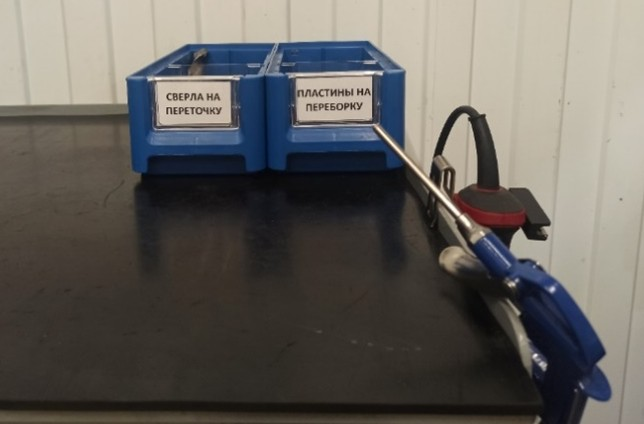

Пригодные пластины слесарь-инструментальщик раскладывает в специальные коробки по принадлежности к резцам, а также по
применяемости к металлам и по радиусам режущих кромок, так же он может данные пластины выдавать по необходимости
операторам.

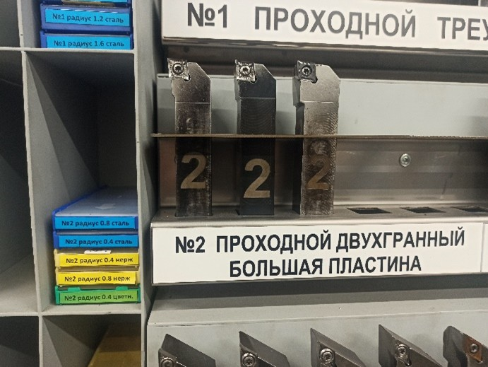
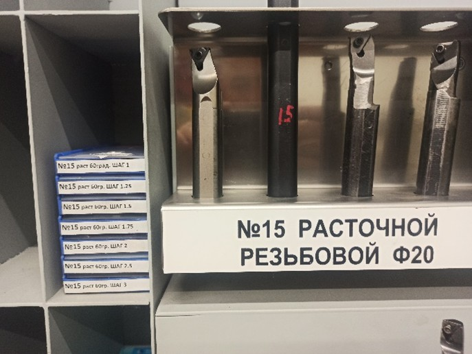

#### 3.1.4. Выдача инструмента и учёт. 📊

Слесарь-инструментальщик отвечает за выдачу и учёт сменных металлорежущих стандартных пластин и прочего стандартного
металлорежущего инструмента.
Учёт производится с помощью программы СОФТ. При выдаче слесарь-инструментальщик заносит в программу СОФТ следующие
данные:

* кому выдан инструмент,
* для какой детали и операции,
* с какой целью (себе в работу, для наладки или для работы ночной смены)

На каждую позицию выставлен определенный лимит, допускаемый к выдаче. При превышении лимита оператор станков с ЧПУ может
получить инструмент только после привлечения наладчика для прояснения ситуации (почему увеличен расход).
Данный процесс позволяет правильно оценивать потребности производства в конкретном металлорежущем инструменте, а также
предотвращать перерасход этого инструмента.

#### 3.1.5. Обход и сборка отработанного инструмента. 🔄

В течении рабочего дня слесарь-инструментальщик проводит обход по станкам для сбора отработанного инструмента у
операторов станков с ЧПУ.

### 3.2 Оператор станков с ЧПУ. 🧑‍🏭

Весь отработанный и снятый со станков, поврежденный или сломанный инструмент оператор станков с ЧПУ складывает у себя на
тележке для того, чтобы слесарь-инструментальщик мог собрать и определить, с какой операции данный инструмент и кто его
снимал.
Оператору станков с ЧПУ следует предоставить слесарю-инструментальщику необходимую информацию по сломанному и
поврежденному инструменту, а именно:

* на каком станке произошел слом,
* причина, по которой слом произошёл.
  В течение дня оператор станков с ЧПУ может получить необходимый стандартный инструмент для работы. Для этого он
  обращается к слесарю-инструментальщику.
  Так же оператору станков с ЧПУ следует собрать необходимый инструмент для работы ночной смены, проявить в этом плане
  полную ответственность, т.к. ночью инструментальная комната будет закрыта.
  При возникновении ситуации, когда для работы ночной смены по каким-то причинам не оставили необходимый инструмент или
  оставили не тот, либо не хватило того, что оставили в работу, оператор станков с ЧПУ обращается с данной проблемой к
  мастеру смены, который имеет право зайти в инструментальную комнату ночью и взять необходимый инструмент из сейфа
  «Неприкосновенного Запаса».

### 3.3 Мастер смены токарного участка. 🧭

Мастер смены токарного участка имеет доступ в инструментальную комнату для возможности решения проблемы в связи с
нехваткой какого-либо инструмента.
В случае, когда необходимо взять какую-либо пластину мастер смены берёт её из коробок с б/у пластинами, имеющими хорошие
кромки. Данные коробки расположены на специальных полках по принадлежности к резцам. В случае если необходимы новые
пластины мастер смены может взять их из сейфа «Неприкосновенного Запаса».

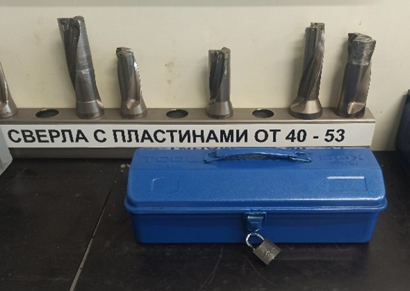

### 3.4 Наладчик, инженер. 🛠

Наладчик или инженер в случае возникновения ситуации, касаемой превышения установленного лимита, выясняет причину
данного превышения, помогает исправить, если проблема в наладке, или принимает решение о замене конфигурации пластины
или о замене на пластину с другим стружколомом или напылением в программе СОФТ, если это необходимо. Повысить лимит на
выдачу инструмента может только наладчик или инженер.
Весь специальный инструмент находится у наладчика, а именно:

> * микрорезцы,
> * спецрезцы – специально заточенные или обниженные (используются на конкретной детали),
> * спецфрезы,
> * твердосплавные свёрла,
> * виброгасящие резцы и комплектующие к ним,
> * редкие резцы (в малом количестве),
> * а также инструмент, закупаемый на конкретные детали.
 
  Наладчик выдает инструмент согласно программе СОФТ, занося в программу те же данные, но только уже на специнструмент.
  По завершению операции на станке наладчику или инженеру необходимо подвести итог – зафиксировать инструмент, которым
  делали эту операцию, скорректировать данные в чек-листе подготовки производства и внести эти данные в ТехПроцесс.

### 3.5 Начальник отдела обеспечения и подготовки производства (НО11Т). 📦

НО11Т отвечает за:

* Контроль выполнения обязанностей сотрудниками, отвечающих за обеспечение производства металлорежущим инструментом.
* Своевременную закупку и доставку на производство необходимого качественного металлорежущего инструмента.
* Контроль за исполнением данного регламента.
