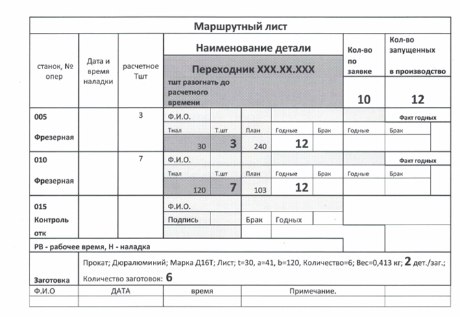
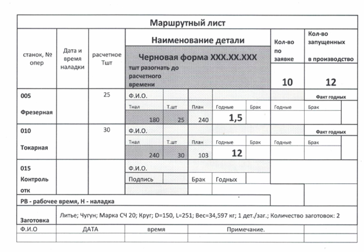

# Заполнение маршрутного листа оператором станков с ЧПУ

Данное письмо направлено на правильное и корректное заполнение маршрутного листа оператором станков с ЧПУ.

В процессе работы мы сталкиваемся с некоторыми особенностями, которые вызывают сомнения в правильности заполнения
маршрутного листа. Данные особенности вызваны:

- изготовлением нескольких изделий из одной заготовки;
- изготовлением изделия, состоящего из 2-х половинок и несущего один общий характер изделия (например, «Горловое
  кольцо»).

## 1. Изготовление нескольких изделий из одной заготовки

Для выставления коммерческого предложения технологом просчитывается время обработки одной единицы изделия и
закладывается заготовка с необходимыми габаритами.  
Далее при создании технологического процесса (далее — ТП) технологом может применяться заготовка на несколько изделий,
что способствует оптимизации и ускорению процесса производства.

При этом в ТП, в листе заготовка указывается эскиз заготовки с нужными габаритами и количество изделий, получаемых из
заготовки (эти же данные прописываются в маршрутном листе).

**Пример:**

Переходник `ХХХ.ХХ.ХХХ`

- количество по заявке — `10 штук`;
- количество фактически запускаемых — `12 штук`;
- заготовка: `Прокат`; `Дюралюминий`; `Марка Дl 6Т`; `Лист`; `t=30, a=41, b=120, Количество=6`; `Вес=0,413 кг`;
  `2 дет./заг.`; `Количество заготовок: 6`;
- Тшт. операции `010` — `7 мин.`;
- операционное станочное время — `14 мин`.

Таким образом, оператор при снятии времени обработки изделия со станка в маршрутный лист записывает:

- время обработки, делённое на 2 (14 мин / 2 = 7 мин);
- в графу с количеством изготовленных деталей — 2 штуки.

  

## 2. Изготовление изделий, состоящих из 2-х половинок

В комплект производства формокомплектов для стекольной промышленности входят изделия, состоящие из 2-х половинок, такие
как:

- горловое кольцо;
- черновая форма;
- чистовая форма.

Технология изготовления данных видов изделий заключается в попеременной отдельной и совместной обработке половинок
изделия. В связи с этим заполнение маршрутного листа имеет особенности:

- если на какой-либо операции обрабатываются отдельно половинки изделия, то в маршрутный лист записывается количество
  целого изделия;
- если на какой-либо операции обрабатываются совместно половинки изделия, то в маршрутный лист записывается количество
  целого изделия.

**Пример:**

В поступившем в производство заказе есть 10 черновых форм. С учётом брака было запущено 12 черновых форм.

- На `005` фрезерной операции половинки одной формы обрабатываются раздельно, поэтому в маршрутный лист записывается 12
  штук целого изделия и время обработки одной формы.
- На `010` токарной операции половинки одной формы обрабатываются совместно, поэтому в маршрутный лист также
  записывается 12 штук целого изделия и время обработки одной формы.

## Итог

Точное заполнение маршрутного листа помогает:

- правильно отслеживать операционное время производства изделия;
- отслеживать загрузку станочного парка и производства в целом;
- изготавливать полное количество годных, готовых к отправке изделий согласно общему плану производства.

---

## Опросный лист к Инструктивному письму по заполнению маршрутного листа оператором станков с ЧПУ

ФИО ___________________
Должность _____________

1. На что направлено данное Инструкционное письмо?

---

2. С какими особенностями сталкиваются во время работы? Чем они вызваны?

---

3. Приведите пример с изготовлением нескольких изделий из одной заготовки.

---

4. Приведите пример с изготовлением изделий, состоящих из 2-х половинок, несущих один общий характер.

---

5. Для чего нужно точное заполнение маршрутного листа?  
